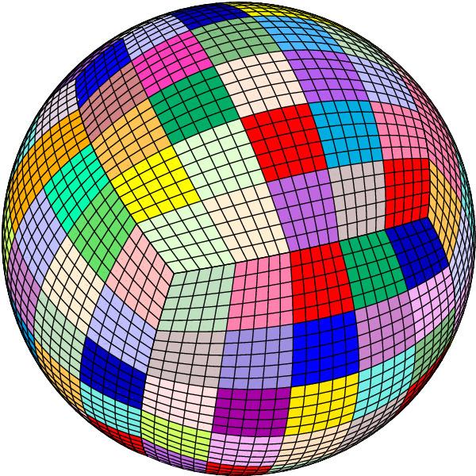
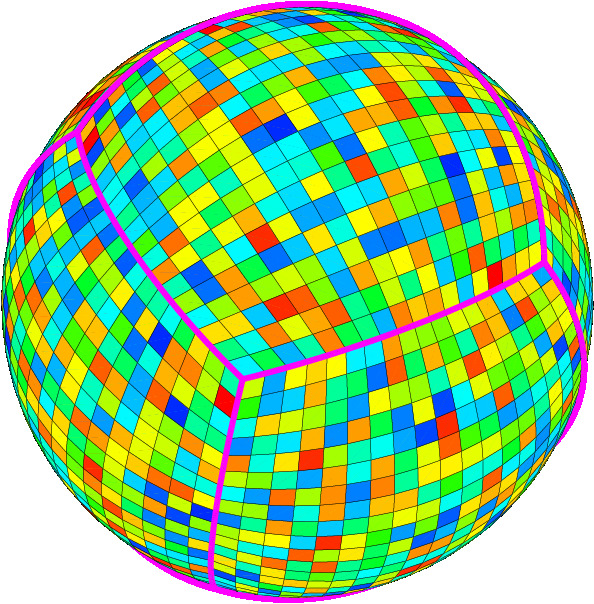

**Table of Contents**

-   [Running the Mesher `xmeshfem3D`](#running-the-mesher-xmeshfem3d)
    -   [Memory requirements](#memory-requirements)

Running the Mesher `xmeshfem3D`
===============================

You are now ready to compile the mesher. In the directory with the source code, type ‘`make meshfem3D`’. If all paths and flags have been set correctly, the mesher should now compile and produce the executable `xmeshfem3D`. Note that all compiled executables are placed into the directory `bin/`. To run the executables, you must call them from the root directory, for example type \``mpirun -np 64 ./bin/meshfem3D`\` to run the mesher in parallel on 64 CPUs. This will allow the executables to find the parameter file `Par_file` in the relative directory location `./DATA`.

Input for the mesher (and the solver) is provided through the parameter file `Par_file`, which resides in the subdirectory `DATA`. Before running the mesher, a number of parameters need to be set in the `Par_file`. This requires a basic understanding of how the SEM is implemented, and we encourage you to read Komatitsch and Vilotte (1998; Komatitsch and Tromp 1999; Chaljub 2000; Komatitsch and Tromp 2002a; Komatitsch and Tromp 2002b; Komatitsch, Ritsema, and Tromp 2002; Chaljub, Capdeville, and Vilotte 2003; Capdeville et al. 2003) and Chaljub and Valette (2004). A detailed theoretical analysis of the dispersion and stability properties of the SEM is available in Cohen (2002), De Basabe and Sen (2007) and Seriani and Oliveira (2007).

In this chapter we will focus on simulations at the scale of the entire globe. Regional simulations will be addressed in Chapter [cha:Regional-Simulations]. The spectral-element mesh for a SPECFEM3D\_GLOBE simulation is based upon a mapping from the cube to the sphere called the *cubed sphere* (Sadourny 1972; Ronchi, Ianoco, and Paolucci 1996). This cubed-sphere mapping breaks the globe into 6 chunks, each of which is further subdivided in terms of \(n^{2}\) mesh slices, where \(n\ge1\) is a positive integer, for a total of \(6\times n^{2}\) slices (Figure [figure:mpislices]). Thus the minimum number of processors required for a global simulation is 6 (although it is theoretically possible to run more than one slice per processor).

  
Figure: Each of the 6 chunks that constitutes the cubed sphere is subdivided in terms of \(n^{2}\) slices of elements, where \(n\ge1\) is a positive integer, for a total of \(6\times n^{2}\) slices (and therefore processors). The figure on the left shows a mesh that is divided in terms of \(6\times5^{2}=150\) slices as indicated by the various colors. In this cartoon, each slice contains \(5\times5=25\) spectral elements at the Earth’s surface. The figure on the right shows a mesh that is divided over \(6\times18^{2}=1944\) processors as indicated by the various colors. Regional simulations can be accommodated by using only 1, 2 or 3 chunks of the cubed sphere. One-chunk simulations may involve a mesh with lateral dimensions smaller than \(90^{\circ}\), thereby accommodating smaller-scale simulations. 

To run the mesher for a global simulation, the following parameters need to be set in the `Par_file` (the list below might be slightly obsolete or incomplete; for an up-to-date version, see comments in the default `Par_file` located in directory `DATA`:

`SIMULATION_TYPE`  
is set to 1 for forward simulations, 2 for adjoint simulations for sources (see Section [sec:Adjoint-simulation-sources]) and 3 for kernel simulations (see Section [sec:Finite-Frequency-Kernels]).

`SAVE_FORWARD`  
is only set to `.true.` for a forward simulation with the last frame of the simulation saved, as part of the finite-frequency kernel calculations (see Section [sec:Finite-Frequency-Kernels]). For a regular forward simulation, leave `SIMULATION_TYPE` and `SAVE_FORWARD` at their default values.

`NCHUNKS`  
must be set to 6 for global simulations.

`ANGULAR_WIDTH_XI_IN_DEGREES`  
Not needed for a global simulation. (See Chapter [cha:Regional-Simulations] for regional simulations.)

`ANGULAR_WIDTH_ETA_IN_DEGREES`  
Not needed for a global simulation. (See Chapter [cha:Regional-Simulations] for regional simulations.)

`CENTER_LATITUDE_IN_DEGREES`  
Not needed for a global simulation. (See Chapter [cha:Regional-Simulations] for regional simulations.)

`CENTER_LONGITUDE_IN_DEGREES`  
Not needed for a global simulation. (See Chapter [cha:Regional-Simulations] for regional simulations.)

`GAMMA_ROTATION_AZIMUTH`  
Not needed for a global simulation. (See Chapter [cha:Regional-Simulations] for regional simulations.)

`NEX_XI`  
The number of spectral elements along one side of a chunk in the cubed sphere (see Figure [figure:mpislices]); this number *must* be a multiple of 16 and 8 \(\times\) a multiple of \(\nprocxi\) defined below. We do not recommend using \(\nexxi\) less than 64 because the curvature of the Earth cannot be honored if one uses too few elements, and distorted elements can lead to inaccurate and unstable simulations, i.e., smaller values of \(\nexxi\) are likely to result in spectral elements with a negative Jacobian, in which case the mesher will exit with an error message. Table [table:nex] summarizes various suitable choices for \(\nexxi\) and the related values of \(\nprocxi\). Based upon benchmarks against semi-analytical normal-mode synthetic seismograms, Komatitsch and Tromp (2002a; Komatitsch and Tromp 2002b) determined that a \(\nexxi=256\) run is accurate to a shortest period of roughly 17 s. Therefore, since accuracy is determined by the number of grid points per shortest wavelength, for any particular value of \(\nexxi\) the simulation will be accurate to a shortest period determined approximately by \[\mbox{shortest period (s)}\simeq(256/\nexxi)\times17.\label{eq:shortest_period}\] The number of grid points in each orthogonal direction of the reference element, i.e., the number of Gauss-Lobatto-Legendre points, is determined by `NGLLX` in the `constants.h` file. In the globe we use \(\mbox{\texttt{NGLLX}}=5\), for a total of \(5^{3}=125\) points per elements. We suggest not to change this value.

`NEX_ETA`  
For global simulations \(\nexeta\) must be set to the same value as \(\nexxi\).

`NPROC_XI`  
The number of processors or slices along one chunk of the cubed sphere (see Figure [figure:mpislices]); we must have \(\nexxi=8\times c\times\nprocxi\), where \(c\ge1\) is a positive integer. See Table [table:nex] for various suitable choices.

`NPROC_ETA`  
For global simulations \(\nproceta\) must be set to the same value as \(\nprocxi\).

`MODEL`  
Must be set to one of the following:

  
`1D_isotropic_prem`  
Isotropic version of the spherically symmetric Preliminary Reference Earth Model (PREM) (Dziewoński and Anderson 1981).

`1D_transversely_isotropic_prem`  
Transversely isotropic version of PREM.

`1D_iasp91`  
Spherically symmetric isotropic IASP91 model (Kennett and Engdahl 1991).

`1D_1066a`  
Spherically symmetric earth model 1066A (Gilbert and Dziewoński 1975). When `ATTENTUATION` is on, it uses an unpublished 1D attenuation model from Scripps.

`1D_ak135f_no_mud`  
Spherically symmetric isotropic AK135 model (Kennett, Engdahl, and Buland 1995) modified to use the density and Q attenuation models of Montagner and Kennett (1995). That modified model is traditionally called AK135-F, see <http://rses.anu.edu.au/seismology/ak135/ak135f.html> for more details. As we do not want to use the 300 m-thick mud layer from that model nor the ocean layer, above the d120 discontinuity we switch back to the classical AK135 model of Kennett, Engdahl, and Buland (1995), i.e., we use AK135-F below and AK135 above.

`1D_ref`  
A 1D Earth model developed by Kustowski, Dziewoński, and Ekstrom (2006). This model is the 1D background model for the 3D models s362ani, s362wmani, s362ani\_prem, and s29ea.

`1D_CCREM`  
A 1D Earth model developed by Ma and Tkalcic (2021) called CCREM: a new reference Earth model from the global coda-correlation wavefield.

`Ishii`  
Combines the 1D transversely isotropic PREM with the anisotropic inner core model defined by Ishii et al. (2002).

for Mars:

`1D_Sohl`  
1D Mars model developed by Sohl and Spohn (1997). This model is model A, mostly constrained by geophysical moment of inertia.

`1D_case65TAY`  
1D Mars reference model developed by Plesa et al. (2021). The model is the 1D reference model for case 65 with a compositional model by Taylor.

`mars_1D`  
1D Mars model as defined in file `mars_1D.dat` in folder `DATA/mars`.

for Moon:

`VPREMOON`  
1D Moon model developed by Garcia et al. (2011). Uses modified seismic model, starting from table 6 (left side, not geodesic model) with velocity values for outer core and solid inner core based on Weber et al. (2011)

For historical reasons and to provide benchmarks against normal-mode synthetics, the mesher accommodates versions of various 1D models with a single crustal layer with the properties of the original upper crust. These ‘one-crust’ models are:

      1D_isotropic_prem_onecrust
      1D_transversely_isotropic_prem_onecrust
      1D_iasp91_onecrust
      1D_1066a_onecrust
      1D_ak135f_no_mud_onecrust

  
`transversely_isotropic_prem_plus_3D_crust_2.0`  
This model has CRUST2.0 (Bassin, Laske, and Masters 2000) on top of a transversely isotropic PREM. We first extrapolate PREM mantle velocity up to the surface, then overwrite the model with CRUST2.0

`s20rts`  
By default, the code uses 3D mantle model S20RTS (Ritsema, Van Heijst, and Woodhouse 1999) and 3D crustal model Crust2.0 (Bassin, Laske, and Masters 2000). Note that S20RTS uses transversely isotropic PREM as a background model, and that we use the PREM radial attenuation model when `ATTENUATION` is incorporated. See Chapter [cha:-Changing-the] for a discussion on how to change 3D models.

`s40rts`  
A global 3D mantle model (Ritsema et al. 2011) succeeding S20RTS with a higher resolution. S40RTS uses transversely isotropic PREM as a backgroun model and the 3D crustal model Crust2.0 (Bassin, Laske, and Masters 2000). We use the PREM radial attenuation model when `ATTENUATION` is incorporated.

`s362ani`  
A global shear-wave speed model developed by Kustowski, Dziewoński, and Ekstrom (2006). In this model, radial anisotropy is confined to the uppermost mantle. The model (and the corresponding mesh) incorporate tomography on the 650 km and 410 km discontinuities in the 1D reference model REF.

`s362wmani`  
A version of S362ANI with anisotropy allowed throughout the mantle.

`s362ani_prem`  
A version of S362ANI calculated using PREM as the 1D reference model.

`s29ea`  
A global model with higher resolution in the upper mantle beneath Eurasia calculated using REF as the 1D reference model.

`3D_anisotropic`  
See Chapter [cha:-Changing-the] for a discussion on how to specify your own 3D anisotropic model.

`3D_attenuation`  
See Chapter [cha:-Changing-the] for a discussion on how to specify your own 3D attenuation model.

`PPM`  
For a user-specified 3D model (Point-Profile-Model) given as ASCII-table, specifying Vs-perturbations with respect to PREM. See Chapter [cha:-Changing-the] for a discussion on how to specify your own 3D model.

`full_sh`  
For a user-specified, transversely isotropic 3D model given in spherical harmonics. Coefficients for the crustal model (up to degree 40) are stored in files named `C**.dat` and `MOHO.dat`, coefficients for the mantle model (up to degree 20) are stored in files named `M**.dat`.
All model files reside in directory `DATA/full_sphericalharmonic_model/`. Note that to use the crustal model, one has to set the crustal type value `ITYPE_CRUSTAL_MODEL = ICRUST_CRUST_SH` in file `setup/constants.h`. This crustal model can be transversely isotropic as well.

`sgloberani_iso`  
By default, the code uses 3D *isotropic* mantle model SGLOBE-rani (Chang et al. 2015) and the 3D crustal model includes perturbations from Crust2.0 (Bassin, Laske, and Masters 2000) as discussed in (Chang et al. 2015). The model is parametrised horizontally in spherical harmonics up to `lmax=35` and with 21 depth splines for the radial direction. Note that SGLOBE-rani uses transversely isotropic PREM as a background model, and that we use the PREM radial attenuation model when `ATTENUATION` is incorporated.

`sgloberani_aniso`  
By default, the code uses 3D *anisotropic* mantle model SGLOBE-rani (Chang et al. 2015) and the 3D crustal model includes perturbations from Crust2.0 (Bassin, Laske, and Masters 2000) as discussed in (Chang et al. 2015). Note that SGLOBE-rani uses transversely isotropic PREM as a background model, and that we use the PREM radial attenuation model when `ATTENUATION` is incorporated.

`SPiRaL`  
A multiresolution global tomography model of seismic wave speeds and radial anisotropy variations in the crust and mantle developed by Simmons et al. (2021). Please see folder `DATA/spiral1.4` for further information on how to install the corresponding model files.

`GLAD_bkmns`  
A Block Mantle & Spherical Harmonics (BKMNS) expansion model developed by Ciardelli et al. (submitted.) for global crust/mantle 3D models GLAD-M25 and GLAD-M15. Please see folder `DATA/gladm25` for further information on how to install the corresponding model files.

for Mars:

`1D_Sohl_3d_crust`  
This model adds a 3D crust on top of the 1D Mars model developed by Sohl and Spohn (1997). The crustal model is defined by the files in folder `DATA/crustmaps/marscrust*.cmap`

`1D_case65TAY_3d_crust`  
This model adds a 3D crust on top of the 1D Mars model developed by Plesa et al. (2021). The crustal model is defined by the files in folder `DATA/crustmaps/marscrust*.cmap`

  
When a 3D mantle model is chosen in `Par_file`, the simulations are performed together with the associated 3D crustal model. For example, model `s362ani` would use by default crustal model Crust2.0. To select the higher-resolution Crust1.0 crustal model instead, one can append it as an ending to the model name, i.e., `***<3D mantle>***_crust1.0`, as for example `s362ani_crust1.0`. In a similar way, various 3D crustal models defined such as `***_crust1.0`, `***_crust2.0`, `***_crustmaps`, `***_epcrust`, `***_eucrust`, `***_crustSH`, `***_sglobecrust` and `***_crustSPiRaL` can be combined with different mantle models. Regional higher-resolution models, such as the European crustal models EPcrust (Molinari and Morelli 2011) and EUCrust-07 (Tesauro, Kaban, and Cloetingh 2008) are embedded by default into the global crustal model Crust1.0.

It is also possible to run simulations using a 3D mantle model with a 1D crustal model on top. This can be done by setting the model in `Par_file` to `***<3D mantle>***_1Dcrust`, e.g., `s20rts_1Dcrust, s362ani_1Dcrust`, etc. In this case, the 1D crustal model will be the one that is used in the 3D mantle model as a reference model (e.g., transversely isotropic PREM for s20rts, REF for s362ani, etc.).

Currently, the only anisotropic inner core model implemented is the one defined by Ishii et al. (2002). To use this anisotropic inner core model, one can append the ending `***<3D mantle>***_AIC` to the mantle model name. With the above crustal ending, as an example one could use `s362ani_crust1.0_AIC`.

`OCEANS`  
Set to `.true.` if the effect of the oceans on seismic wave propagation should be incorporated based upon the approximate treatment discussed in Komatitsch and Tromp (2002b). This feature is inexpensive from a numerical perspective, both in terms of memory requirements and CPU time. This approximation is accurate at periods of roughly 20 s and longer. At shorter periods the effect of water phases/reverberations is not taken into account, even when the flag is on.

`ELLIPTICITY`  
Set to `.true.` if the mesh should make the Earth model elliptical in shape according to Clairaut’s equation (Dahlen and Tromp 1998). This feature adds no cost to the simulation. After adding ellipticity, the mesh becomes elliptical and thus geocentric and geodetic/geographic latitudes and colatitudes differ (longitudes are unchanged). From Dahlen and Tromp (1998): “Spherically-symmetric Earth models all have the same hydrostatic surface ellipticity 1/299.8. This is 0.5 percent smaller than observed flattening of best-fitting ellipsoid 1/298.3. The discrepancy is referred to as the ”excess equatorial bulge of the Earth“, an early discovery of artificial satellite geodesy.” From Paul Melchior, IUGG General Assembly, Vienna, Austria, August 1991 Union lecture, available at www.agu.org/books: “It turns out that the spheroidal models constructed on the basis of the spherically-symmetric models (PREM, 1066A) by using the Clairaut differential equation to calculate the flattening in function of the radius vector imply hydrostaticity. These have surface ellipticity 1/299.8 and a corresponding dynamical flattening of .0033 (PREM). The actual ellipticty of the Earth for a best-fitting ellipsoid is 1/298.3 with a corresponding dynamical flattening of .0034.”

Thus, flattening f = 1/299.8 is what is used in SPECFEM3D\_GLOBE, as it should. And eccentricity squared \(e^2 = 1 - (1-f)^2 = 1 - (1 - 1/299.8)^2 = 0.00665998813529\), and the correction factor used in the code to convert geographic latitudes to geocentric is \(1 - e^2 = (1-f)^2 = (1 - 1/299.8)^2 = 0.9933400118647\). As a comparison, the classical World Geodetic System reference ellipsoid WGS 84 (see e.g. <http://en.wikipedia.org/wiki/World_Geodetic_System>) has \(f = 1/298.2572236\).

For Mars, a flattening factor 1/169.8 is used (based on Smith et al. 1999, Science, 284). For Moon, a flattening factor 1/901.0 is currently taken. These values can be modified in file `setup/constants.h`.

`TOPOGRAPHY`  
Set to `.true.` if topography and bathymetry should be incorporated based upon model ETOPO4 (NOAA 1988). This feature adds no cost to the simulation. If you want to use other topographic models, please see folder `DATA/topo_bathy/` for further infos and change the name of the topographic model to use in file `setup/constants.h` before re-compiling the code.

`GRAVITY`  
Set to `.true.` if self-gravitation should be incorporated in the Cowling approximation (Komatitsch and Tromp 2002b; Dahlen and Tromp 1998). Turning this feature on is relatively inexpensive, both from the perspective of memory requirements as well as in terms of computational speed.

`ROTATION`  
Set to `.true.` if the Coriolis effect should be incorporated. Turning this feature on is relatively cheap numerically.

`ATTENUATION`  
Set to `.true.` if attenuation should be incorporated. Turning this feature on increases the memory requirements significantly (roughly by a factor of 2), and is numerically fairly expensive. Of course for realistic simulations this flag should be turned on. See Komatitsch and Tromp (1999; Komatitsch and Tromp 2002a) for a discussion on the implementation of attenuation based upon standard linear solids.

`ABSORBING_CONDITIONS`  
Set to `.false.` for global simulations. See Chapter [cha:Regional-Simulations] for regional simulations.

`RECORD_LENGTH_IN_MINUTES`  
Choose the desired record length of the synthetic seismograms (in minutes). This controls the length of the numerical simulation, i.e., twice the record length requires twice as much CPU time. This feature is not used at the time of meshing but is required for the solver, i.e., you may change this parameter after running the mesher.

`PARTIAL_PHYS_DISPERSION_ONLY` or `UNDO_ATTENUATION`  
To undo attenuation for sensitivity kernel calculations or forward runs with `SAVE_FORWARD` use one (and only one) of the two flags below. `UNDO_ATTENUATION` is much better (it is exact) and is simpler to use but it requires a significant amount of disk space for temporary storage. It has the advantage of requiring only two simulations for adjoint tomography instead of three in the case of `PARTIAL_PHYS_DISPERSION_ONLY`, i.e. for adjoint tomography it is globally significantly less expensive (each run is slightly more expensive, but only two runs are needed instead of three).
When using `PARTIAL_PHYS_DISPERSION_ONLY`, to make the approximation reasonably OK you need to take the following steps:

1.  To calculate synthetic seismograms, do a forward simulation with full attenuation for the model of interest. The goal is to get synthetics that match the data as closely as possible.

2.  Make measurements and produce adjoint sources by comparing the resulting synthetics with the data. In the simplest case of a cross-correlation traveltime measurement, use the time-reversed synthetic in the window of interest as the adjoint source.

3.  Do a second forward calculation with `PARTIAL_PHYS_DISPERSION_ONLY = .true.` and save the last snapshot.

4.  Do an adjoint calculation using the adjoint source calculated in 1/, the forward wavefield reconstructed based on 2b/, use `PARTIAL_PHYS_DISPERSION_ONLY = .true.` for the adjoint wavefield, and save the kernel.

Thus the kernel calculation uses `PARTIAL_PHYS_DISPERSION_ONLY = .true.` for both the forward and the adjoint wavefields. This is in the spirit of the banana-donut kernels. But the data that are assimilated are based on the full 3D synthetic with attenuation.
Another, equivalent way of explaining it is:

1.  Calculate synthetics with full attenuation for the current model. Compare these to the data and measure frequency-dependent traveltime anomalies \(\Delta \tau(\omega)\), e.g.. based upon multi-tapering.

2.  Calculate synthetics with `PARTIAL_PHYS_DISPERSION_ONLY = .true.` and construct adjoint sources by combining the seismograms from this run with the measurements from 1/. So in the expressions for the multi-taper adjoint source you use the measurements from 1/, but synthetics calculated with `PARTIAL_PHYS_DISPERSION_ONLY = .true.`.

3.  Construct a kernel by calculating an adjoint wavefield based on the sources constructed in 2/ and convolving it with a forward wavefield with `PARTIAL_PHYS_DISPERSION_ONLY = .true.`. Again, both the forward and adjoint calculations use `PARTIAL_PHYS_DISPERSION_ONLY = .true.`.

Note that if you replace multi-taper measurements with cross-correlation measurements you will measure a cross-correlation traveltime anomaly in 1/, i.e., some delay time \(\Delta T\). Then you would calculate an adjoint wavefield with `PARTIAL_PHYS_DISPERSION_ONLY = .true.` and use the resulting time-reversed seismograms weighted by \(\Delta T\) as the adjoint source. This wavefield interacts with a forward wavefield calculated with `PARTIAL_PHYS_DISPERSION_ONLY = .true.`. If \(\Delta T=1\) one gets a banana-donut kernel, i.e., a kernel for the case in which there are no observed seismograms (no data), as explained for instance on page 5 of Zhou, Liu, and Tromp (2011).

`MOVIE_SURFACE`  
Set to `.false.`, unless you want to create a movie of seismic wave propagation on the Earth’s surface. Turning this option on generates large output files. See Section [sec:Movies] for a discussion on the generation of movies. This feature is not used at the time of meshing but is relevant for the solver.

`MOVIE_VOLUME`  
Set to `.false.`, unless you want to create a movie of seismic wave propagation in the Earth’s interior. Turning this option on generates huge output files. See Section [sec:Movies] for a discussion on the generation of movies. This feature is not used at the time of meshing but is relevant for the solver.

`NTSTEP_BETWEEN_FRAMES`  
Determines the number of timesteps between movie frames. Typically you want to save a snapshot every 100 timesteps. The smaller you make this number the more output will be generated! See Section [sec:Movies] for a discussion on the generation of movies. This feature is not used at the time of meshing but is relevant for the solver.

`HDUR_MOVIE`  
determines the half duration of the source time function for the movie simulations. When this parameter is set to be 0, a default half duration that corresponds to the accuracy of the simulation is provided.

`SAVE_MESH_FILES`  
Set this flag to `.true``.` to save AVS , OpenDX , or ParaView mesh files for subsequent viewing. Turning the flag on generates large (distributed) files in the `LOCAL_PATH` directory. See Section [sec:Meshes] for a discussion of mesh viewing features.

`NUMBER_OF_RUNS`  
On machines with a run-time limit, for instance for a batch/queue system, a simulation may need to be completed in stages. This option allows you to select the number of stages in which the simulation will be completed (1, 2 or 3). Choose 1 for a run without restart files. This feature is not used at the time of meshing but is required for the solver. At the end of the first or second stage of a multi-stage simulation, large files are written to the file system to save the current state of the simulation. This state is read back from the file system at the beginning of the next stage of the multi-stage run. Reading and writing the states can be very time consuming depending on the nature of the network and the file system (in this case writing to the local file system, i.e., the disk on a node, is preferable).

`NUMBER_OF_THIS_RUN`  
If you choose to perform the run in stages, you need to tell the solver what stage run to perform. This feature is not used at the time of meshing but is required for the solver.

`LOCAL_PATH`  
Directory in which the databases generated by the mesher will be written. Generally one uses a directory on the local disk of the compute nodes, although on some machines these databases are written on a parallel (global) file system (see also the earlier discussion of the `LOCAL_PATH_IS_ALSO_GLOBAL` flag in Chapter [cha:Getting-Started]). The mesher generates the necessary databases in parallel, one set for each of the \(6\times\nprocxi^{2}\) slices that constitutes the mesh (see Figure [figure:mpislices]). After the mesher finishes, you can log in to one of the compute nodes and view the contents of the `LOCAL_PATH` directory to see the (many) files generated by the mesher.

`NTSTEP_BETWEEN_OUTPUT_INFO`  
This parameter specifies the interval at which basic information about a run is written to the file system (`timestamp*` files in the `OUTPUT_FILES` directory). If you have access to a fast machine, set `NTSTEP_BETWEEN_OUTPUT_INFO` to a relatively high value (e.g., at least 100, or even 1000 or more) to avoid writing output text files too often. This feature is not used at the time of meshing. One can set this parameter to a larger value than the number of time steps to avoid writing output during the run.

`NTSTEP_BETWEEN_OUTPUT_SEISMOS`  
This parameter specifies the interval at which synthetic seismograms are written in the `LOCAL_PATH` directory. The seismograms can be created in three different formats by setting the parameters `OUTPUT_SEISMOS_ASCII_TEXT`, `OUTPUT_SEISMOS_SAC_ALPHANUM` and `OUTPUT_SEI-`
`SMOS_SAC_BINARY`. One can choose any combination of these parameters (details on the formats follow in the description of each parameter). SAC is a signal-processing software package. If a run crashes, you may still find usable (but shorter than requested) seismograms in this directory. On a fast machine set `NTSTEP_BETWEEN_OUTPUT_SEISMOS` to a relatively high value to avoid writing to the seismograms too often. This feature is not used at the time of meshing.

`NTSTEP_BETWEEN_READ_ADJSRC`  
The number of adjoint sources read in each time for an adjoint simulation.

`USE_FORCE_POINT_SOURCE`  
Turn this flag on to use a (tilted) `FORCESOLUTION` force point source instead of a `CMTSOLUTION` moment-tensor source. When the force source does not fall exactly at a grid point, the solver interpolates the force between grid points using Lagrange interpolants. This option can be useful for vertical force, normal force, tilted force, impact force, etc. Note that in the `FORCESOLUTION` file, you will need to edit the East, North and vertical components of an arbitrary (not necessarily unitary, the code will normalize it automatically) direction vector of the force vector; thus refer to Appendix [cha:Reference-Frame-Convention] for the orientation of the reference frame. This vector is made unitary internally in the solver and thus only its direction matters here; its norm is ignored and the norm of the force used is the factor force source times the source time function.

`OUTPUT_SEISMOS_ASCII_TEXT`  
Set this flag to `.true.` if you want to have the synthetic seismograms written in two-column ASCII format (the first column contains time in seconds and the second column the displacement in meters of the recorded signal, no header information). Files will be named with extension `.ascii`, e.g., `NT.STA.?X?.sem.ascii` where NT and STA are the network and station codes given in `STATIONS` file, and `?X?` is the channel code (see Appendix [cha:channel-codes]).

`OUTPUT_SEISMOS_SAC_ALPHANUM`  
Set this flag to `.true.` if you want to have the synthetic seismograms written in alphanumeric (human readable) SAC format, which includes header information on the source and receiver parameters (e.g., source/receiver coordinates, station name, etc., see Appendix [cha:SAC-headers]). For details on the format, please check the SAC webpage . Files will be named with extension `.sacan`.

`OUTPUT_SEISMOS_SAC_BINARY`  
Set this flag to `.true.` if you want to have the synthetic seismograms written in binary SAC format. The header information included is the same as for the alphanumeric SAC format (see Appendix [cha:SAC-headers]). Using this format requires the least disk space, which may be particulary important if you have a large number of stations. For details on the binary format please also check the SAC webpage and Appendix [cha:SAC-headers]. Files will be named with extension `.sac`.

`ROTATE_SEISMOGRAMS_RT`  
Set this flag to `.true.` if you want to have radial (R) and transverse (T) horizontal components of the synthetic seismograms (default is `.false.` \(\rightarrow\) East (E) and North (N) components).

`WRITE_SEISMOGRAMS_BY_MAIN`  
Set this flag to `.true.` if you want to have all the seismograms written by the main process (no need to collect them on the nodes after the run).

`SAVE_ALL_SEISMOS_IN_ONE_FILE`  
Set this flag to `.true.` if you want to have all the seismograms saved in one large combined file instead of one file per seismogram to avoid overloading shared non-local file systems such as GPFS for instance.

`USE_BINARY_FOR_LARGE_FILE`  
Set this flag to `.true.` if you want to use binary instead of ASCII for that large file (not used if SAVE\_ALL\_SEISMOS\_IN \_ONE\_FILE = .false.)

`RECEIVERS_CAN_BE_BURIED`  
This flag accommodates stations with instruments that are buried, i.e., the solver will calculate seismograms at the burial depth specified in the `STATIONS` file. This feature is not used at the time of meshing.

`PRINT_SOURCE_TIME_FUNCTION`  
Turn this flag on to print information about the source time function in the file `OUTPUT_FILES/plot_source_time_function.txt`. This feature is not used at the time of meshing.

`NUMBER_OF_SIMULTANEOUS_RUNS`  
adds the ability to run several calculations (several earthquakes) in an embarrassingly-parallel fashion from within the same run; this can be useful when using a very large supercomputer to compute many earthquakes in a catalog, in which case it can be better from a batch job submission point of view to start fewer and much larger jobs, each of them computing several earthquakes in parallel.

To turn that option on, set parameter NUMBER\_OF\_SIMULTANEOUS\_RUNS to a value greater than 1. To implement that, we create NUMBER\_OF\_SIMULTANEOUS\_RUNS MPI sub-communicators, each of them being labeled “my\_local\_mpi\_comm\_world”, and we use them in all the routines in “src/shared/parallel.f90”, except in MPI\_ABORT() because in that case we need to kill the entire run.

When that option is on, of course the number of processor cores used to start the code in the batch system must be a multiple of NUMBER\_OF\_SIMULTANEOUS\_RUNS, all the individual runs must use the same number of processor cores, which as usual is NPROC in the Par\_file, and thus the total number of processor cores to request from the batch system should be NUMBER\_OF\_SIMULTANEOUS\_RUNS \* NPROC. All the runs to perform must be placed in directories called run0001, run0002, run0003 and so on (with exactly four digits).

Imagine you have 10 independent calculations to do, each of them on 100 cores; you have three options:

1/ submit 10 jobs to the batch system

2/ submit a single job on 1000 cores to the batch, and in that script create a sub-array of jobs to start 10 jobs, each running on 100 cores (see e.g. <http://www.schedmd.com/slurmdocs/job_array.html> )

3/ submit a single job on 1000 cores to the batch, start SPECFEM3D on 1000 cores, create 10 sub-communicators, cd into one of 10 subdirectories (called e.g. run0001, run0002,... run0010) depending on the sub-communicator your MPI rank belongs to, and run normally on 100 cores using that sub-communicator.

The option NUMBER\_OF\_SIMULTANEOUS\_RUNS implements 3/.

`BROADCAST_SAME_MESH_AND_MODEL`  
: if we perform simultaneous runs in parallel, if only the source and receivers vary between these runs but not the mesh nor the model (velocity and density) then we can also read the mesh and model files from a single run in the beginning and broadcast them to all the others; for a large number of simultaneous runs for instance when solving inverse problems iteratively this can DRASTICALLY reduce I/Os to disk in the solver (by a factor equal to NUMBER\_OF\_SIMULTANEOUS\_RUNS), and reducing I/Os is crucial in the case of huge runs. Thus, always set this option to .true. if the mesh and the model are the same for all simultaneous runs. In that case there is no need to duplicate the mesh and model file database (the content of the DATABASES\_MPI directories) in each of the run0001, run0002,... directories, it is sufficient to have one in run0001 and the code will broadcast it to the others).

`USE_FAILSAFE_MECHANISM`  
: if one or a few of these simultaneous runs fail, kill all the runs or let the others finish using a fail-safe mechanism (in most cases, should be set to true).

TODO / future work to do: currently the BROADCAST\_SAME\_MESH\_AND\_MODEL option assumes to have the (main) mesh files in run0001/DATABASES\_MPI or run0001/OUTPUT\_FILES/DATABASES\_MPI. However, for adjoint runs you still need a DATABASES\_MPI folder in each of the sub-runs directories, e.g. run0002/DATABASES\_MPI, etc. to store the forward wavefields, kernels etc. of each sub-run. This would not be needed for forward simulations.

TODO / future work to do: the sensitivity kernel summing and smoothing tools in directory src/tomography are currently not ported to this new option to do many runs simultaneously, only the solver (src/specfem3d) is. Thus these tools should work, but in their current version will need to be run for each simulation result independently. More precisely, the current kernel summing and smoothing routines work fine, with the exception that you need to move out the mesh files (and also the parameters). This works because these routines consider multiple runs by design. You simply have to provide them the directories where the kernels are.

[table:nex]

| `NPROC_XI` | processors | `NEX_XI`   |      |      |      |       |       |       |       |       |       |
|:-----------------------:|:----------:|:----:|:----:|:----:|:----:|:-----:|:-----:|:-----:|:-----:|:-----:|:-----:|
|            1            |      6     |  64  |  80  |  96  |  112 |  128  |  144  |  160  |  176  |  192  |  208  |
|            2            |     24     |  64  |  80  |  96  |  112 |  128  |  144  |  160  |  176  |  192  |  208  |
|            3            |     54     |  96  |  144 |  192 |  240 |  288  |  336  |  384  |  432  |  480  |  528  |
|            4            |     96     |  64  |  96  |  128 |  160 |  192  |  224  |  256  |  288  |  320  |  352  |
|            5            |     150    |  80  |  160 |  240 |  320 |  400  |  480  |  560  |  640  |  720  |  800  |
|            6            |     216    |  96  |  144 |  192 |  240 |  288  |  336  |  384  |  432  |  480  |  528  |
|            7            |     294    |  112 |  224 |  336 |  448 |  560  |  672  |  784  |  896  |  1008 |  1120 |
|            8            |     384    |  64  |  128 |  192 |  256 |  320  |  384  |  448  |  512  |  576  |  640  |
|            9            |     486    |  144 |  288 |  432 |  576 |  720  |  864  |  1008 |  1152 |  1296 |  1440 |
|            10           |     600    |  80  |  160 |  240 |  320 |  400  |  480  |  560  |  640  |  720  |  800  |
|            11           |     726    |  176 |  352 |  528 |  704 |  880  |  1056 |  1232 |  1408 |  1584 |  1760 |
|            12           |     864    |  96  |  192 |  288 |  384 |  480  |  576  |  672  |  768  |  864  |  960  |
|            13           |    1014    |  208 |  416 |  624 |  832 |  1040 |  1248 |  1456 |  1664 |  1872 |  2080 |
|            14           |    1176    |  112 |  224 |  336 |  448 |  560  |  672  |  784  |  896  |  1008 |  1120 |
|            15           |    1350    |  240 |  480 |  720 |  960 |  1200 |  1440 |  1680 |  1920 |  2160 |  2400 |
|            16           |    1536    |  128 |  256 |  384 |  512 |  640  |  768  |  896  |  1024 |  1152 |  1280 |
|            17           |    1734    |  272 |  544 |  816 | 1088 |  1360 |  1632 |  1904 |  2176 |  2448 |  2720 |
|            18           |    1944    |  144 |  288 |  432 |  576 |  720  |  864  |  1008 |  1152 |  1296 |  1440 |
|            19           |    2166    |  304 |  608 |  912 | 1216 |  1520 |  1824 |  2128 |  2432 |  2736 |  3040 |
|            20           |    2400    |  160 |  320 |  480 |  640 |  800  |  960  |  1120 |  1280 |  1440 |  1600 |
|            21           |    2646    |  336 |  672 | 1008 | 1344 |  1680 |  2016 |  2352 |  2688 |  3024 |  3360 |
|            22           |    2904    |  176 |  352 |  528 |  704 |  880  |  1056 |  1232 |  1408 |  1584 |  1760 |
|            23           |    3174    |  368 |  736 | 1104 | 1472 |  1840 |  2208 |  2576 |  2944 |  3312 |  3680 |
|            24           |    3456    |  192 |  384 |  576 |  768 |  960  |  1152 |  1344 |  1536 |  1728 |  1920 |
|            25           |    3750    |  400 |  800 | 1200 | 1600 |  2000 |  2400 |  2800 |  3200 |  3600 |  4000 |
|            26           |    4056    |  208 |  416 |  624 |  832 |  1040 |  1248 |  1456 |  1664 |  1872 |  2080 |
|            27           |    4374    |  432 |  864 | 1296 | 1728 |  2160 |  2592 |  3024 |  3456 |  3888 |  4320 |
|            28           |    4704    |  224 |  448 |  672 |  896 |  1120 |  1344 |  1568 |  1792 |  2016 |  2240 |
|            29           |    5046    |  464 |  928 | 1392 | 1856 |  2320 |  2784 |  3248 |  3712 |  4176 |  4640 |
|            30           |    5400    |  240 |  480 |  720 |  960 |  1200 |  1440 |  1680 |  1920 |  2160 |  2400 |
|            31           |    5766    |  496 |  992 | 1488 | 1984 |  2480 |  2976 |  3472 |  3968 |  4464 |  4960 |
|            32           |    6144    |  256 |  512 |  768 | 1024 |  1280 |  1536 |  1792 |  2048 |  2304 |  2560 |
|            33           |    6534    |  528 | 1056 | 1584 | 2112 |  2640 |  3168 |  3696 |  4224 |  4752 |  5280 |
|            34           |    6936    |  272 |  544 |  816 | 1088 |  1360 |  1632 |  1904 |  2176 |  2448 |  2720 |
|            35           |    7350    |  560 | 1120 | 1680 | 2240 |  2800 |  3360 |  3920 |  4480 |  5040 |  5600 |
|            36           |    7776    |  288 |  576 |  864 | 1152 |  1440 |  1728 |  2016 |  2304 |  2592 |  2880 |
|            37           |    8214    |  592 | 1184 | 1776 | 2368 |  2960 |  3552 |  4144 |  4736 |  5328 |  5920 |
|            38           |    8664    |  304 |  608 |  912 | 1216 |  1520 |  1824 |  2128 |  2432 |  2736 |  3040 |
|            39           |    9126    |  624 | 1248 | 1872 | 2496 |  3120 |  3744 |  4368 |  4992 |  5616 |  6240 |
|            40           |    9600    |  320 |  640 |  960 | 1280 |  1600 |  1920 |  2240 |  2560 |  2880 |  3200 |
|            41           |    10086   |  656 | 1312 | 1968 | 2624 |  3280 |  3936 |  4592 |  5248 |  5904 |  6560 |
|            42           |    10584   |  336 |  672 | 1008 | 1344 |  1680 |  2016 |  2352 |  2688 |  3024 |  3360 |
|            43           |    11094   |  688 | 1376 | 2064 | 2752 |  3440 |  4128 |  4816 |  5504 |  6192 |  6880 |
|            44           |    11616   |  352 |  704 | 1056 | 1408 |  1760 |  2112 |  2464 |  2816 |  3168 |  3520 |
|            45           |    12150   |  720 | 1440 | 2160 | 2880 |  3600 |  4320 |  5040 |  5760 |  6480 |  7200 |
|            46           |    12696   |  368 |  736 | 1104 | 1472 |  1840 |  2208 |  2576 |  2944 |  3312 |  3680 |
|            47           |    13254   |  752 | 1504 | 2256 | 3008 |  3760 |  4512 |  5264 |  6016 |  6768 |  7520 |
|            48           |    13824   |  384 |  768 | 1152 | 1536 |  1920 |  2304 |  2688 |  3072 |  3456 |  3840 |
|            49           |    14406   |  784 | 1568 | 2352 | 3136 |  3920 |  4704 |  5488 |  6272 |  7056 |  7840 |
|            50           |    15000   |  400 |  800 | 1200 | 1600 |  2000 |  2400 |  2800 |  3200 |  3600 |  4000 |
|            51           |    15606   |  816 | 1632 | 2448 | 3264 |  4080 |  4896 |  5712 |  6528 |  7344 |  8160 |
|            52           |    16224   |  416 |  832 | 1248 | 1664 |  2080 |  2496 |  2912 |  3328 |  3744 |  4160 |
|            53           |    16854   |  848 | 1696 | 2544 | 3392 |  4240 |  5088 |  5936 |  6784 |  7632 |  8480 |
|            54           |    17496   |  432 |  864 | 1296 | 1728 |  2160 |  2592 |  3024 |  3456 |  3888 |  4320 |
|            55           |    18150   |  880 | 1760 | 2640 | 3520 |  4400 |  5280 |  6160 |  7040 |  7920 |  8800 |
|            56           |    18816   |  448 |  896 | 1344 | 1792 |  2240 |  2688 |  3136 |  3584 |  4032 |  4480 |
|            57           |    19494   |  912 | 1824 | 2736 | 3648 |  4560 |  5472 |  6384 |  7296 |  8208 |  9120 |
|            58           |    20184   |  464 |  928 | 1392 | 1856 |  2320 |  2784 |  3248 |  3712 |  4176 |  4640 |
|            59           |    20886   |  944 | 1888 | 2832 | 3776 |  4720 |  5664 |  6608 |  7552 |  8496 |  9440 |
|            60           |    21600   |  480 |  960 | 1440 | 1920 |  2400 |  2880 |  3360 |  3840 |  4320 |  4800 |
|            61           |    22326   |  976 | 1952 | 2928 | 3904 |  4880 |  5856 |  6832 |  7808 |  8784 |  9760 |
|            62           |    23064   |  496 |  992 | 1488 | 1984 |  2480 |  2976 |  3472 |  3968 |  4464 |  4960 |
|            63           |    23814   | 1008 | 2016 | 3024 | 4032 |  5040 |  6048 |  7056 |  8064 |  9072 | 10080 |
|            64           |    24576   |  512 | 1024 | 1536 | 2048 |  2560 |  3072 |  3584 |  4096 |  4608 |  5120 |
|            65           |    25350   | 1040 | 2080 | 3120 | 4160 |  5200 |  6240 |  7280 |  8320 |  9360 | 10400 |
|            66           |    26136   |  528 | 1056 | 1584 | 2112 |  2640 |  3168 |  3696 |  4224 |  4752 |  5280 |
|            67           |    26934   | 1072 | 2144 | 3216 | 4288 |  5360 |  6432 |  7504 |  8576 |  9648 | 10720 |
|            68           |    27744   |  544 | 1088 | 1632 | 2176 |  2720 |  3264 |  3808 |  4352 |  4896 |  5440 |
|            69           |    28566   | 1104 | 2208 | 3312 | 4416 |  5520 |  6624 |  7728 |  8832 |  9936 | 11040 |
|            70           |    29400   |  560 | 1120 | 1680 | 2240 |  2800 |  3360 |  3920 |  4480 |  5040 |  5600 |
|            71           |    30246   | 1136 | 2272 | 3408 | 4544 |  5680 |  6816 |  7952 |  9088 | 10224 | 11360 |
|            72           |    31104   |  576 | 1152 | 1728 | 2304 |  2880 |  3456 |  4032 |  4608 |  5184 |  5760 |
|            73           |    31974   | 1168 | 2336 | 3504 | 4672 |  5840 |  7008 |  8176 |  9344 | 10512 | 11680 |
|            74           |    32856   |  592 | 1184 | 1776 | 2368 |  2960 |  3552 |  4144 |  4736 |  5328 |  5920 |
|            75           |    33750   | 1200 | 2400 | 3600 | 4800 |  6000 |  7200 |  8400 |  9600 | 10800 | 12000 |
|            76           |    34656   |  608 | 1216 | 1824 | 2432 |  3040 |  3648 |  4256 |  4864 |  5472 |  6080 |
|            77           |    35574   | 1232 | 2464 | 3696 | 4928 |  6160 |  7392 |  8624 |  9856 | 11088 | 12320 |
|            78           |    36504   |  624 | 1248 | 1872 | 2496 |  3120 |  3744 |  4368 |  4992 |  5616 |  6240 |
|            79           |    37446   | 1264 | 2528 | 3792 | 5056 |  6320 |  7584 |  8848 | 10112 | 11376 | 12640 |
|            80           |    38400   |  640 | 1280 | 1920 | 2560 |  3200 |  3840 |  4480 |  5120 |  5760 |  6400 |
|            81           |    39366   | 1296 | 2592 | 3888 | 5184 |  6480 |  7776 |  9072 | 10368 | 11664 | 12960 |
|            82           |    40344   |  656 | 1312 | 1968 | 2624 |  3280 |  3936 |  4592 |  5248 |  5904 |  6560 |
|            83           |    41334   | 1328 | 2656 | 3984 | 5312 |  6640 |  7968 |  9296 | 10624 | 11952 | 13280 |
|            84           |    42336   |  672 | 1344 | 2016 | 2688 |  3360 |  4032 |  4704 |  5376 |  6048 |  6720 |
|            85           |    43350   | 1360 | 2720 | 4080 | 5440 |  6800 |  8160 |  9520 | 10880 | 12240 | 13600 |
|            86           |    44376   |  688 | 1376 | 2064 | 2752 |  3440 |  4128 |  4816 |  5504 |  6192 |  6880 |
|            87           |    45414   | 1392 | 2784 | 4176 | 5568 |  6960 |  8352 |  9744 | 11136 | 12528 | 13920 |
|            88           |    46464   |  704 | 1408 | 2112 | 2816 |  3520 |  4224 |  4928 |  5632 |  6336 |  7040 |
|            89           |    47526   | 1424 | 2848 | 4272 | 5696 |  7120 |  8544 |  9968 | 11392 | 12816 | 14240 |
|            90           |    48600   |  720 | 1440 | 2160 | 2880 |  3600 |  4320 |  5040 |  5760 |  6480 |  7200 |
|            91           |    49686   | 1456 | 2912 | 4368 | 5824 |  7280 |  8736 | 10192 | 11648 | 13104 | 14560 |
|            92           |    50784   |  736 | 1472 | 2208 | 2944 |  3680 |  4416 |  5152 |  5888 |  6624 |  7360 |
|            93           |    51894   | 1488 | 2976 | 4464 | 5952 |  7440 |  8928 | 10416 | 11904 | 13392 | 14880 |
|            94           |    53016   |  752 | 1504 | 2256 | 3008 |  3760 |  4512 |  5264 |  6016 |  6768 |  7520 |
|            95           |    54150   | 1520 | 3040 | 4560 | 6080 |  7600 |  9120 | 10640 | 12160 | 13680 | 15200 |
|            96           |    55296   |  768 | 1536 | 2304 | 3072 |  3840 |  4608 |  5376 |  6144 |  6912 |  7680 |
|            97           |    56454   | 1552 | 3104 | 4656 | 6208 |  7760 |  9312 | 10864 | 12416 | 13968 | 15520 |
|            98           |    57624   |  784 | 1568 | 2352 | 3136 |  3920 |  4704 |  5488 |  6272 |  7056 |  7840 |
|            99           |    58806   | 1584 | 3168 | 4752 | 6336 |  7920 |  9504 | 11088 | 12672 | 14256 | 15840 |
|           100           |    60000   |  800 | 1600 | 2400 | 3200 |  4000 |  4800 |  5600 |  6400 |  7200 |  8000 |
|           101           |    61206   | 1616 | 3232 | 4848 | 6464 |  8080 |  9696 | 11312 | 12928 | 14544 | 16160 |
|           102           |    62424   |  816 | 1632 | 2448 | 3264 |  4080 |  4896 |  5712 |  6528 |  7344 |  8160 |
|           103           |    63654   | 1648 | 3296 | 4944 | 6592 |  8240 |  9888 | 11536 | 13184 | 14832 | 16480 |
|           104           |    64896   |  832 | 1664 | 2496 | 3328 |  4160 |  4992 |  5824 |  6656 |  7488 |  8320 |
|           105           |    66150   | 1680 | 3360 | 5040 | 6720 |  8400 | 10080 | 11760 | 13440 | 15120 | 16800 |
|           106           |    67416   |  848 | 1696 | 2544 | 3392 |  4240 |  5088 |  5936 |  6784 |  7632 |  8480 |
|           107           |    68694   | 1712 | 3424 | 5136 | 6848 |  8560 | 10272 | 11984 | 13696 | 15408 | 17120 |
|           108           |    69984   |  864 | 1728 | 2592 | 3456 |  4320 |  5184 |  6048 |  6912 |  7776 |  8640 |
|           109           |    71286   | 1744 | 3488 | 5232 | 6976 |  8720 | 10464 | 12208 | 13952 | 15696 | 17440 |
|           110           |    72600   |  880 | 1760 | 2640 | 3520 |  4400 |  5280 |  6160 |  7040 |  7920 |  8800 |
|           111           |    73926   | 1776 | 3552 | 5328 | 7104 |  8880 | 10656 | 12432 | 14208 | 15984 | 17760 |
|           112           |    75264   |  896 | 1792 | 2688 | 3584 |  4480 |  5376 |  6272 |  7168 |  8064 |  8960 |
|           113           |    76614   | 1808 | 3616 | 5424 | 7232 |  9040 | 10848 | 12656 | 14464 | 16272 | 18080 |
|           114           |    77976   |  912 | 1824 | 2736 | 3648 |  4560 |  5472 |  6384 |  7296 |  8208 |  9120 |
|           115           |    79350   | 1840 | 3680 | 5520 | 7360 |  9200 | 11040 | 12880 | 14720 | 16560 | 18400 |
|           116           |    80736   |  928 | 1856 | 2784 | 3712 |  4640 |  5568 |  6496 |  7424 |  8352 |  9280 |
|           117           |    82134   | 1872 | 3744 | 5616 | 7488 |  9360 | 11232 | 13104 | 14976 | 16848 | 18720 |
|           118           |    83544   |  944 | 1888 | 2832 | 3776 |  4720 |  5664 |  6608 |  7552 |  8496 |  9440 |
|           119           |    84966   | 1904 | 3808 | 5712 | 7616 |  9520 | 11424 | 13328 | 15232 | 17136 | 19040 |
|           120           |    86400   |  960 | 1920 | 2880 | 3840 |  4800 |  5760 |  6720 |  7680 |  8640 |  9600 |
|           121           |    87846   | 1936 | 3872 | 5808 | 7744 |  9680 | 11616 | 13552 | 15488 | 17424 | 19360 |
|           122           |    89304   |  976 | 1952 | 2928 | 3904 |  4880 |  5856 |  6832 |  7808 |  8784 |  9760 |
|           123           |    90774   | 1968 | 3936 | 5904 | 7872 |  9840 | 11808 | 13776 | 15744 | 17712 | 19680 |
|           124           |    92256   |  992 | 1984 | 2976 | 3968 |  4960 |  5952 |  6944 |  7936 |  8928 |  9920 |
|           125           |    93750   | 2000 | 4000 | 6000 | 8000 | 10000 | 12000 | 14000 | 16000 | 18000 | 20000 |
|           126           |    95256   | 1008 | 2016 | 3024 | 4032 |  5040 |  6048 |  7056 |  8064 |  9072 | 10080 |
|           127           |    96774   | 2032 | 4064 | 6096 | 8128 | 10160 | 12192 | 14224 | 16256 | 18288 | 20320 |
|           128           |    98304   | 1024 | 2048 | 3072 | 4096 |  5120 |  6144 |  7168 |  8192 |  9216 | 10240 |
|           129           |    99846   | 2064 | 4128 | 6192 | 8256 | 10320 | 12384 | 14448 | 16512 | 18576 | 20640 |

Finally, you need to provide a file that tells MPI what compute nodes to use for the simulations. The file must have a number of entries (one entry per line) at least equal to the number of processors needed for the run. A sample file is provided in the file `mymachines`. This file is not used by the mesher or solver, but is required by the `go_mesher` and `go_solver` default job submission scripts. See Chapter [cha:Running-Scheduler] for information about running the code on a system with a scheduler, e.g., LSF.

Now that you have set the appropriate parameters in the `Par_file` and have compiled the mesher, you are ready to launch it! This is most easily accomplished based upon the `go_mesher` script. When you run on a PC cluster, the script assumes that the nodes are named n001, n002, etc. If this is not the case, change the `tr -d n` line in the script. You may also need to edit the last command at the end of the script that invokes the `mpirun` command.

Mesher output is provided in the `OUTPUT_FILES` directory in `output_mesher.txt`; this file provides lots of details about the mesh that was generated. Alternatively, output can be directed to the screen instead by uncommenting a line in `constants.h`:

    ! uncomment this to write messages to the screen
    ! integer, parameter :: IMAIN = ISTANDARD_OUTPUT

Note that on very fast machines, writing to the screen may slow down the code.

Another file generated by the mesher is the header file `OUTPUT_FILES/values_from_mesher.h`. This file specifies a number of constants and flags needed by the solver. These values are passed statically to the solver for reasons of speed. Some useful statistics about the mesh are also provided in this file.

For a given model, set of nodes, and set of parameters in `Par_file`, one only needs to run the mesher once and for all, even if one wants to run several simulations with different sources and/or receivers (the source and receiver information is used in the solver only).

Please note that it is difficult to correctly sample S waves in the inner core of the Earth because S-wave velocity is very small there. Therefore, correctly sampling S waves in the inner core would require a very dense mesh, which in turn would drastically reduce the time step of the explicit time scheme because the P wave velocity is very high in the inner core (Poisson’s ratio is roughly equal to 0.44). Because shear wave attenuation is very high in the inner core (\(Q_{\mu}\) is approximately equal to 85), we have therefore decided to design the inner core mesh such that P waves are very well sampled but S waves are right at the sampling limit or even slightly below. This works fine because spurious numerical oscillations due to S-wave subsampling are almost completely suppressed by attenuation. However, this implies that one should not use SPECFEM3D\_GLOBE with the regular mesh and period estimates of Table [table:nex] to study the PKJKP phase very precisely. If one is interested in that phase, one should use typically 1.5 times to twice the number of elements NEX indicated in the table.

Regarding fluid/solid coupling at the CMB and ICB, in SPECFEM3D\_GLOBE we do not use the fluid-solid formulation of Komatitsch and Tromp (2002a) and Komatitsch and Tromp (2002b) anymore, we now use a displacement potential in the fluid (rather than a velocity potential as in Komatitsch and Tromp (2002a) and Komatitsch and Tromp (2002b)). This leads to the simpler fluid-solid matching condition introduced by Chaljub and Valette (2004) with no numerical iterations at the CMB and ICB.

For accuracy reasons, in the mesher the coordinates of the mesh points (arrays xstore, ystore and zstore) are always created in double precision. If the solver is compiled in single precision mode, the mesh coordinates are converted to single precision before being saved in the local mesh files.

Memory requirements
-------------------

The SPECFEM3D\_GLOBE memory requirements can be estimated before or after running the mesher using the small serial program `./bin/xcreate_header_file`, which reads the input file `DATA/Par_file` and displays the total amount of memory that will be needed by the mesher and the solver to run it. This way, users can easily modify the parameters and check that their simulation will fit in memory on their machine. The file created by `xcreate_header_file` is called `OUTPUT_FILES/values_from_mesher.h` and contains even more details about the future simulation.

Please note that running these codes is optional because no information needed by the solver is generated.

References
----------

Bassin, C., G. Laske, and G. Masters. 2000. “The Current Limits of Resolution for Surface Wave Tomography in North America.” *EOS* 81: F897.

Capdeville, Y., E. Chaljub, J. P. Vilotte, and J. P. Montagner. 2003. “Coupling the Spectral Element Method with a Modal Solution for Elastic Wave Propagation in Global Earth Models.” *Geophys. J. Int.* 152: 34–67.

Chaljub, E. 2000. “Modélisation Numérique de La Propagation d’ondes Sismiques En Géométrie Sphérique : Application À La Sismologie Globale (Numerical Modeling of the Propagation of Seismic Waves in Spherical Geometry: application to Global Seismology).” PhD thesis, Paris, France: Université Paris VII Denis Diderot.

Chaljub, E., and B. Valette. 2004. “Spectral Element Modelling of Three-Dimensional Wave Propagation in a Self-Gravitating Earth with an Arbitrarily Stratified Outer Core.” *Geophys. J. Int.* 158: 131–41.

Chaljub, E., Y. Capdeville, and J. P. Vilotte. 2003. “Solving Elastodynamics in a Fluid-Solid Heterogeneous Sphere: A Parallel Spectral-Element Approximation on Non-Conforming Grids.” *J. Comput. Phys.* 187 (2): 457–91.

Chang, S.-J., A.M.G. Ferreira, J. Ritsema, H.J. van Heijst, and J.H. Woodhouse. 2015. “Joint Inversion for Global Isotropic and Radially Anisotropic Mantle Structure Including Crustal Thickness Perturbations.” *J. Geophys. Res.* 120: 4278–4300.

Ciardelli, C., E. Bozdag, D. Peter, and S. van der Lee. submitted. “SphGLLTools: A Toolbox for Visualization of Large Seismic Model Files Based on 3D Spectral-Element Simulations.” *Computers & Geosciences*.

Cohen, Gary. 2002. *Higher-Order Numerical Methods for Transient Wave Equations*. Berlin, Germany: Springer-Verlag.

Dahlen, F. A., and J. Tromp. 1998. *Theoretical Global Seismology*. Princeton, New-Jersey, USA: Princeton University Press.

De Basabe, Jonás D., and Mrinal K. Sen. 2007. “Grid Dispersion and Stability Criteria of Some Common Finite-Element Methods for Acoustic and Elastic Wave Equations.” *Geophysics* 72 (6): T81–95. doi:[10.1190/1.2785046](http://dx.doi.org/10.1190/1.2785046).

Dziewoński, A. M., and D. L. Anderson. 1981. “Preliminary Reference Earth Model.” *Phys. Earth Planet. Inter.* 25 (4): 297–356.

Garcia, R.F., J. Gagnepain-Beyneix, S. Chevrot, and P. Lognonné. 2011. “Very Preliminary Reference Moon Model.” *Phys. Earth Planet. Inter.* 188: 96–113.

Gilbert, F., and A. M. Dziewoński. 1975. “An Application of Normal Mode Theory to the Retrieval of Structural Parameters and Source Mechanisms from Seismic Spectra.” *Philos. Trans. R. Soc. London A* 278: 187–269.

Ishii, M., J. Tromp, A. M. Dziewoński, and G. Ekström. 2002. “Joint Inversion of Normal Mode and Body Wave Data for Inner Core Anisotropy - 1. Laterally Homogeneous Anisotropy.” *J. Geophys. Res. Solid Earth* 107 (B12): 2379.

Kennett, B. L. N., and E. R. Engdahl. 1991. “Traveltimes for Global Earthquake Location and Phase Identification.” *Geophys. J. Int.* 105: 429–65.

Kennett, B. L. N., E. R. Engdahl, and R. Buland. 1995. “Constraints on Seismic Velocities in the Earth from Traveltimes.” *Geophys. J. Int.* 122: 108–24.

Komatitsch, D., and J. Tromp. 1999. “Introduction to the Spectral-Element Method for 3-D Seismic Wave Propagation.” *Geophys. J. Int.* 139 (3): 806–22. doi:[10.1046/j.1365-246x.1999.00967.x](http://dx.doi.org/10.1046/j.1365-246x.1999.00967.x).

———. 2002a. “Spectral-Element Simulations of Global Seismic Wave Propagation-I. Validation.” *Geophys. J. Int.* 149 (2): 390–412. doi:[10.1046/j.1365-246X.2002.01653.x](http://dx.doi.org/10.1046/j.1365-246X.2002.01653.x).

———. 2002b. “Spectral-Element Simulations of Global Seismic Wave Propagation-II. 3-D Models, Oceans, Rotation, and Self-Gravitation.” *Geophys. J. Int.* 150 (1): 303–18. doi:[10.1046/j.1365-246X.2002.01716.x](http://dx.doi.org/10.1046/j.1365-246X.2002.01716.x).

Komatitsch, D., and J. P. Vilotte. 1998. “The Spectral-Element Method: An Efficient Tool to Simulate the Seismic Response of 2D and 3D Geological Structures.” *Bull. Seism. Soc. Am.* 88 (2): 368–92.

Komatitsch, D., J. Ritsema, and J. Tromp. 2002. “The Spectral-Element Method, Beowulf Computing, and Global Seismology.” *Science* 298 (5599): 1737–42. doi:[10.1126/science.1076024](http://dx.doi.org/10.1126/science.1076024).

Kustowski, B., A. M. Dziewoński, and G. Ekstrom. 2006. “Modeling the Anisotropic Shear-Wave Velocity Structure in the Earth’s Mantle on Global and Regional Scales.” *EOS* 87 (52): Abstract S41E–E02.

Ma, X., and H. Tkalcic. 2021. “CCREM: New Reference Earth Model from the Global Coda-Correlation Wavefield.” *J. Geophys. Res. Solid Earth* 126 (e2021JB022515).

Molinari, I., and A. Morelli. 2011. “EPcrust: A Reference Crustal Model for the European Plate.” *Geophys. J. Int.* 185 (1): 352–64.

Montagner, J. P., and B. L. N. Kennett. 1995. “How to Reconcile Body-Wave and Normal-Mode Reference Earth Models?” *Geophys. J. Int.* 122: 229–48.

NOAA. 1988. *National Oceanic and Atmospheric Administration (NOAA) Product Information Catalog - ETOPO5 Earth Topography 5-Minute Digital Model*. Washington D.C., USA: U.S. Department of Commerce.

Plesa, A.-C., E. Bozdag, A. Rivoldini, M. Knapmeyer, S. M. McLennan, S. Padovan, N. Tosi, et al. 2021. “Seismic Velocity Variations in a 3D Martian Mantle: Implications for the InSight Measurements.” *J. Geophys. Res. Planets* 126 (6): e2020JE006755.

Ritsema, J., A. Deuss, H. J. Van Heijst, and J. H. Woodhouse. 2011. “S40RTS: A Degree-40 Shear-Velocity Model for the Mantle from New Rayleigh Wave Dispersion, Teleseismic Traveltime and Normal-Mode Splitting Function Measurements.” *Geophys. J. Int.* 184 (3): 1223–36. doi:[10.1111/j.1365-246X.2010.04884.x](http://dx.doi.org/10.1111/j.1365-246X.2010.04884.x).

Ritsema, J., H. J. Van Heijst, and J. H. Woodhouse. 1999. “Complex Shear Velocity Structure Imaged Beneath Africa and Iceland.” *Science* 286: 1925–28.

Ronchi, C., R. Ianoco, and P. S. Paolucci. 1996. “The ‘Cubed Sphere’: A New Method for the Solution of Partial Differential Equations in Spherical Geometry.” *J. Comput. Phys.* 124: 93–114.

Sadourny, R. 1972. “Conservative Finite-Difference Approximations of the Primitive Equations on Quasi-Uniform Spherical Grids.” *Monthly Weather Review* 100: 136–44.

Seriani, Géza, and Saulo P. Oliveira. 2007. “Optimal Blended Spectral-Element Operators for Acoustic Wave Modeling.” *Geophysics* 72 (5): SM95–M106. doi:[10.1190/1.2750715](http://dx.doi.org/10.1190/1.2750715).

Simmons, N. A., S. C. Myers, C. Morency, A. Chiang, and D. R. Knapp. 2021. “SPiRaL: A Multiresolution Global Tomography Model of Seismic Wave Speeds and Radial Anisotropy Variations in the Crust and Mantle.” *Geophysical Journal International* 227 (2): 1366–91.

Sohl, F., and T. Spohn. 1997. “The Interior Structure of Mars: Implications from SNC Meteorites.” *J. Geophys. Res.* 102: 1613–35.

Tesauro, M., M. K. Kaban, and S. A. P. L. Cloetingh. 2008. “EuCrust-07: A New Reference Model for the European Crust.” *Geophys. Res. Lett.* 35: L05313. doi:[10.1029/2007GL032244](http://dx.doi.org/10.1029/2007GL032244).

Weber, R. C., P.-Y. Lin, E.J. Garnero, Q. Williams, and P. Lognonné. 2011. “Seismic Detection of the Lunar Core.” *Science* 331: 309–12.

Zhou, Ying, Qinya Liu, and Jeroen Tromp. 2011. “Surface Wave Sensitivity: Mode Summation Versus Adjoint SEM.” *Geophys. J. Int.* 187 (3): 1560–76. doi:[10.1111/j.1365-246X.2011.05212.x](http://dx.doi.org/10.1111/j.1365-246X.2011.05212.x).

-----
> This documentation has been automatically generated by [pandoc](http://www.pandoc.org)
> based on the User manual (LaTeX version) in folder doc/USER_MANUAL/
> (May 18, 2022)

