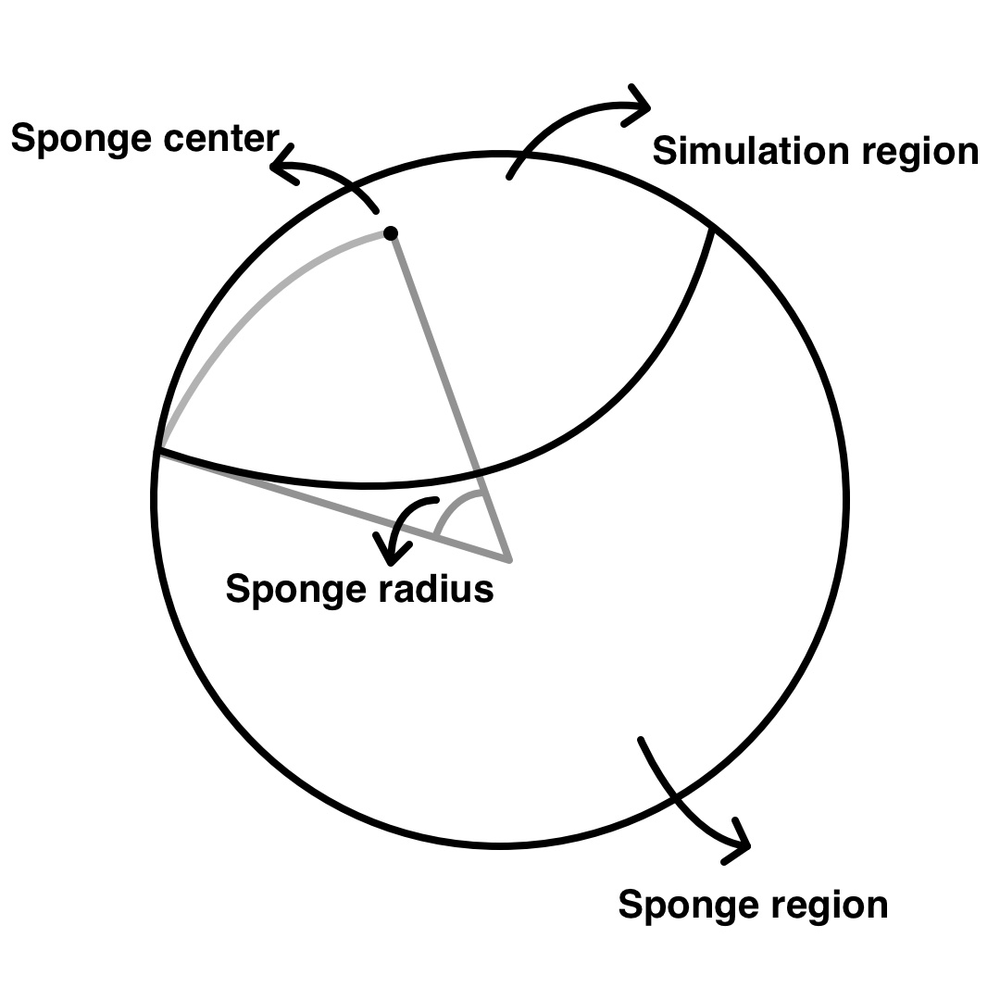

**Table of Contents**

- [Regional Simulations](#cha:Regional-Simulations)
  - [One-Chunk Simulations](#sec:One-Chunk-Simulations)
    - [Mesh cutoff](#sec:Mesh-cutoff)
    - [Absorbing boundaries](#sec:Absorbing-boundaries)
    - [Mesh resolution](#sec:Mesh-resolution)
  - [References](#references)

Regional Simulations
====================

The code has the option of running in one-chunk or six-chunk mode. The one-chunk options may be used for higher resolution regional simulations. A one-chunk mesh may have lateral dimensions other than the customary $90^{\circ}$ per chunk, which can further increase the resolution of the mesh, and thus reduce the shortest period in the synthetic seismograms (but of course then also reducing the time step in order for the simulation to remain stable).

A disadvantage of regional simulations is that one needs to use approximate absorbing boundary conditions on the side and bottom edges of the model (e.g., see Komatitsch and Tromp (1999) for a description of the paraxial boundary conditions used). Figure [\[fig:3D-spectral-element-mesh\]](#fig:3D-spectral-element-mesh) and Figure [\[fig:Close-up-view-of\]](#fig:Close-up-view-of) show an example of a one-chunk mesh centered on the Japan subduction zone, applied in the Japan regional waveform simulation (Chen et al. 2007).

One-Chunk Simulations
---------------------

For a one-chunk regional simulation the following parameters need to be set in the `Par_file`:

`NCHUNKS`  
Must be set to 1.

`ANGULAR_WIDTH_XI_IN_DEGREES`  
Denotes the width of one side of the chunk ($90^{\circ}$ is a classical value, but you can make it more or less if you want).

`ANGULAR_WIDTH_ETA_IN_DEGREES`  
Denotes the width of the second side of the chunk ($90^{\circ}$ is a classical value, but you can make it more or less if you want). Note that this value may be different from `ANGULAR_WIDTH_XI_IN_DEGREES`.

`CENTER_LATITUDE_IN_DEGREES`  
Defines the latitude of the center of the chunk (degrees).

`CENTER_LONGITUDE_IN_DEGREES`  
Defines the longitude of the center of the chunk (degrees).

`GAMMA_ROTATION_AZIMUTH`  
Defines the rotation angle of the chunk about its center measured counter clockwise from due North (degrees). The corners of the mesh are output in `OUTPUT_FILES/values_from_mesher.h`. The output corner progression in `OUTPUT_FILES/values_from_mesher.h` is bottom left, bottom right, top left, top right. The rotation azimuth can be changed in the `Par_file` and the corners output `(``OUTPUT_FILES/`
`values_from_mesher.h``)` by using `xcreate_header_file`. It is important to note that the mesher or the solver does not need to be run to determine the limits of a 1-chunk simulation.

`NEX_XI`  
The number of spectral elements along the $\xi$ side of the chunk. This number *must* be 8 $\times$ a multiple of $\nprocxi$ defined below. For a $90^{\circ}$ chunk, we do not recommend using $\nexxi$ less than 64 because the curvature of the Earth cannot be honored if one uses too few elements, which results in inaccurate and unstable simulations.

`NEX_ETA`  
The number of spectral elements along the $\eta$ side of the chunk. This number *must* be 8 $\times$ a multiple of $\nproceta$ defined below. Note that in order to get elements that are close to square on the Earth’s surface, the following ratios should be similar:

    ANGULAR_WIDTH_XI_IN_DEGREES / NEX_XI
    ANGULAR_WIDTH_ETA_IN_DEGREES / NEX_ETA

Because of the geometry of the cubed sphere, the option of having different values for $\nexxi$ and $\nexeta$ is available only for regional simulations when $\nchunks=1$ (1/6th of the sphere).

`NPROC_XI`  
The number of processors or mesh slices along the $\xi$ side of the chunk. To accommodate the mesh doubling layers, we must have $\nexxi=8\times c\times\nprocxi$, where $c\ge1$ is a positive integer. See Table [\[table:nex\]](#table:nex) for various suitable choices.

`NPROC_ETA`  
The number of processors or slices along the $\eta$ side of the chunk; we must have $\nexeta=8\times c\times\nproceta$, where $c\ge1$ is a positive integer. $\nprocxi$ and $\nproceta$ must be equal when $\nchunks=6$.

![S-wave velocity anomalies from the global tomographic model s20rts (Ritsema and Van Heijst 2000) are superimposed on the mesh. For parallel computing purposes, the one-chunk SEM simulation is subdivided in terms of 64 slices. The center of the chunk is at (38.5$^{\circ}$ N, 137.5$^{\circ}$ E), and the lateral dimensions are 30$^{\circ}$ $\times$ 30$^{\circ}$. Two doubling layers are indicated at a depth of 25 km (PREM Moho depth) and a depth of about 1650 km. Shows full view of 25 neighboring slices; see Figure [1.2](#fig:Close-up-view-of) 
Figure: S-wave velocity anomalies from the global tomographic model s20rts (Ritsema and Van Heijst 2000) are superimposed on the mesh. For parallel computing purposes, the one-chunk SEM simulation is subdivided in terms of 64 slices. The center of the chunk is at (38.5$^{\circ}$ N, 137.5$^{\circ}$ E), and the lateral dimensions are 30$^{\circ}$ $\times$ 30$^{\circ}$. Two doubling layers are indicated at a depth of 25 km (PREM Moho depth) and a depth of about 1650 km. Shows full view of 25 neighboring slices; see Figure [1.2
 for close-up of upper mantle mesh.](figures/fig5a.jpg)

.
Figure: Close-up view of the upper mantle mesh shown in Figure [1.1
. Note that the element size in the crust (top layer) is 13 km $\times$ 13 km, and that the size of the spectral elements is doubled in the upper mantle. The velocity variation is captured by NGLL = 5 grid points in each direction of the elements (Komatitsch and Tromp 2002a, 2002b).](figures/fig5b.jpg)

### Mesh cutoff

By default, the mesher will create a full one-chunk mesh, i.e., for all three regions, crust/mantle, outer core and inner core respectively. The mesh thus goes down to the inner core, which for very small regional, or even local, simulations would not be needed. Furthermore, the default one-chunk mesh will place a first doubling layer below the Moho and a second one below the 771-km depth layer.

To create more specific local meshes, an additional option `REGIONAL_MESH_CUTOFF` together with accompanying parameters have been been added to the `Par_file`:

`REGIONAL_MESH_CUTOFF`  
For regional simulations, choosing this flag will cut-off the mesh at a mesh layer below the given input depth, specified by `REGIONAL_MESH_CUTOFF_DEPTH`.

`REGIONAL_MESH_CUTOFF_DEPTH`  
For cutoff meshes, determines the cutoff depth in km (possible selections are 24.4, 80, 220, 400, 600, 670, 771)

`REGIONAL_MESH_ADD_2ND_DOUBLING`  
Setting the flag to `.true.` will move the second doubling layer below the 220-km depth layer, to also have a second mesh coarsening possibility for the cut-off mesh.

With these mesh cutoffs parameters, the mesher will remove elements from a standard one-chunk mesh below the cut-off depth. To further tweak and define local meshes, for example by adding multiple doubling layers (similar to the SPECFEM3D_Cartesian mesher), the following parameters can be added to the `Par_file` which only take effect if the flag `REGIONAL_MESH_CUTOFF` has been turned on:

`USE_LOCAL_MESH`  
Setting this flag to `.true.` will turn on the local mesh layout.

`NUMBER_OF_LAYERS_CRUST`  
For the local mesh layout, determines the number of element layers in the crust. The crustal Moho depth used will be the ficticious Moho depth, i.e., at either 40 or 35 km depth depending on the `RMOHO_STRETCH_ADJUSTMENT` setting in file `setup/constants.h`.

`NUMBER_OF_LAYERS_MANTLE`  
For the local mesh layout, determines the number of element layers in the mantle. The mantle depth is given by the `REGIONAL_MESH_CUTOFF_DEPTH` setting.

`NDOUBLINGS`  
Sets the number of doubling layers in the local mesh. A maximum of 5 doubling layers is accepted. For each doubling layer, the element layer number must be specified.

`NZ_DOUBLING_1`  
Sets the position of the first doubling layer (counting the mesh element layers from top down). Additional doubling layer position can be specified by adding `NZ_DOUBLING_2`, `NZ_DOUBLING_3`, .. up to `NZ_DOUBLING_5`.

Applying such a local mesh layout will affect the time step size, and therefore requires the selection of an appropriate time step size. To override the default time step size estimation, one can explicitly specify the size by adding the `DT` parameter:

`DT`  
A user-specified value for the time step size (in seconds). This setting will override the meshers estimated time step size. To set an appropriate value, one can check in file `OUTPUT_FILES/output_mesher.txt` the output given by the mesher, where you will find a section on the verification of mesh parameters with a maximum suggested time step for the crust/mantle region.

### Absorbing boundaries

For regional simulations, the following options in the `Par_file` will add absorbing boundary conditions:

`ABSORBING_CONDITIONS`  
Set to `.true.` for regional simulations. For instance, see Komatitsch and Tromp (1999) for a description of the paraxial boundary conditions used. Note that these conditions are never perfect, and in particular surface waves may partially reflect off the artificial boundaries. Note also that certain arrivals, e.g., PKIKPPKIKP, will be missing from the synthetics.

`ABSORB_USING_GLOBAL_SPONGE`  
An alternative to `ABSORBING_CONDITIONS`. Set to `.true.` to run a global simulation with sponge layers applied. See Figure [\[fig:Sponge-illustration\]](#fig:Sponge-illustration) for an illustration. Enabling this flag will result in a simulation that has less reflected waves from the boundaries compared with enabling `ABSORBING_CONDITIONS`, but with significant higher computational costs.

`SPONGE_LATITUDE_IN_DEGREES`  
Latitide of the sponge center.

`SPONGE_LONGITUDE_IN_DEGREES`  
Longitude of the sponge center.

`SPONGE_RADIUS_IN_DEGREES`  
Radius of the sponge region.

Figure: An illustration of running simulation with sponge. This is a regional simulation that happens in the simulation region, the quality factor in the sponge region gradually transits to 30.

### Mesh resolution

When the width of the chunk is different from $90^{\circ}$ (or the number of elements is greater than 1248), the radial distribution of elements needs to be adjusted as well to maintain spectral elements that are as cube-like as possible. The code attempts to do this, but be sure to view the mesh with your favorite graphics package to make sure that the element are well behaved.

Remember: a high-quality mesh is paramount for accurate simulations. In addition to a reorganization of the radial distribution of elements, the time stepping and period range in which the attenuation is applied is automatically determined. The minimum and maximum periods for attenuation are:

$$\omega_{max}=\omega_{min}\times10^{W_{3}}$$

where $W_{3}$ is the optimal width in frequency for 3 Standard Linear Solids, about 1.75. See `read_compute_parameters.f90` for more details.

The time stepping is determined in a similar fashion as Equation (48) in Komatitsch and Tromp (2002a):

dt = $S_{c}$ Element Width in km ($r=$ICB) / Velocity ($r=$ICB)

where $S_{c}$ is the stability condition (about 0.4). We use the radius at the inner core boundary because this is where the maximum velocity/element width occurs. Again, see `read_compute_parameters``.f90` for all the details.

The approximate shortest period at which a regional simulation is accurate may be determined based upon the empirical relation $$\mbox{shortest period (s)}\simeq(256/\nexxi)\times(\texttt{ANGULAR\_WIDTH\_XI\_IN\_DEGREES}/90)\times17.\label{eq:shortest_period_regional}$$

References
----------

Chen, M., J. Tromp, D. Helmberger, and H. Kanamori. 2007. “Waveform Modeling of the Slab Beneath Japan.” *J. Geophys. Res.* 112: B02305. <https://doi.org/10.1029/2006JB004394>.

Komatitsch, D., and J. Tromp. 1999. “Introduction to the Spectral-Element Method for 3-D Seismic Wave Propagation.” *Geophys. J. Int.* 139 (3): 806–22. <https://doi.org/10.1046/j.1365-246x.1999.00967.x>.

———. 2002a. “Spectral-Element Simulations of Global Seismic Wave Propagation-I. Validation.” *Geophys. J. Int.* 149 (2): 390–412. <https://doi.org/10.1046/j.1365-246X.2002.01653.x>.

———. 2002b. “Spectral-Element Simulations of Global Seismic Wave Propagation-II. 3-D Models, Oceans, Rotation, and Self-Gravitation.” *Geophys. J. Int.* 150 (1): 303–18. <https://doi.org/10.1046/j.1365-246X.2002.01716.x>.

Ritsema, J., and H. J. Van Heijst. 2000. “Seismic Imaging of Structural Heterogeneity in Earth’s Mantle: Evidence for Large-Scale Mantle Flow.” *Science Progress* 83: 243–59.

-----
> This documentation has been automatically generated by [pandoc](http://www.pandoc.org)
> based on the User manual (LaTeX version) in folder doc/USER_MANUAL/
> (Dec 20, 2023)

