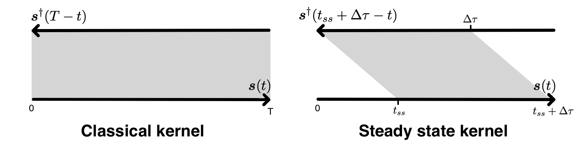

**Table of Contents**

- [Adjoint Simulations](#cha:Adjoint-Simulations)
  - [Adjoint Simulations for Sources Only (not for the Model)](#sec:Adjoint-simulation-sources)
  - [Adjoint Simulations for Finite-Frequency Kernels (Kernel Simulation)](#sec:Adjoint-simulation-finite)
  - [References](#references)

Adjoint Simulations
===================

Adjoint simulations are generally performed for two distinct applications. First, they can be used for earthquake source inversions, especially earthquakes with large ruptures such as the Sumatra-Andaman event (Lay et al. 2005; Ammon et al. 2005; Park et al. 2005). Second, they can be used to generate finite-frequency sensitivity kernels that are a critical part of tomographic inversions based upon 3D reference models (Tromp, Tape, and Liu 2005; Qinya Liu and Tromp 2006; Tromp, Komatitsch, and Liu 2008; Q. Liu and Tromp 2008). In either case, source parameter or velocity structure updates are sought to minimize a specific misfit function (e.g., waveform or traveltime differences), and the adjoint simulation provides a means of computing the gradient of the misfit function and further reducing it in successive iterations. Applications and procedures pertaining to source studies and finite-frequency kernels are discussed in Sections [1.1](#sec:Adjoint-simulation-sources) and [1.2](#sec:Adjoint-simulation-finite), respectively. The two related parameters in the `Par_file` are `SIMULATION_TYPE` (1, 2 or 3) and `SAVE_FORWARD` (boolean).

Adjoint Simulations for Sources Only (not for the Model)
--------------------------------------------------------

In the case where a specific misfit function is minimized to invert for the earthquake source parameters, the gradient of the misfit function with respect to these source parameters can be computed by placing time-reversed seismograms at the receivers and using them as sources in an adjoint simulation, and then the value of the gradient is obtained from the adjoint seismograms recorded at the original earthquake location.

1.  **Prepare the adjoint sources**

    1.  First, run a regular forward simlation (`SIMULATION_TYPE = 1` and `SAVE_FORWARD = .false.`). You can automatically set these two variables using the `utils/change_simulation_type.pl` script:

            utils/change_simulation_type.pl -f

        and then collect the recorded seismograms at all the stations given in `DATA/STATIONS`.

    2.  Then select the stations for which you want to compute the time-reversed adjoint sources and run the adjoint simulation, and compile them into the `DATA/STATIONS_ADJOINT` file, which has the same format as the regular `DATA/STATIONS` file.

        - Depending on what type of misfit function is used for the source inversion, adjoint sources need to be computed from the original recorded seismograms for the selected stations and saved in the `SEM/` directory with the format `NT.STA.?X?.adj`, where `STA`, `NT` are the station name and network code given in the `DATA/STATIONS_ADJOINT` file, and `?X?` represents the channel name of a particular adjoint seismogram where the first letter corresponds to the band code governed by the resolution of simulations, for example, generally `MX?` for the current resolution of global simulations (see Appendix [\[cha:channel-codes\]](#cha:channel-codes) for details). The last letter of channel names is the component name `E/N/Z`.

        - The adjoint seismograms are in the same format as the original seismogram (`NT.STA.?X?.sem?`), with the same start time, time interval and record length.

    3.  Notice that even if you choose to time reverse only one component from one specific station, you still need to supply all three components because the code is expecting them (you can set the other two components to be zero).

    4.  Also note that since time-reversal is done in the code itself, no explicit time-reversing is needed for the preparation of the adjoint sources, i.e., the adjoint sources are in the same forward time sense as the original recorded seismograms.

2.  **Set the related parameters and run the adjoint simulation**
    In the `DATA/Par_file`, set the two related parameters to be `SIMULATION_TYPE = 2` and `SAVE_FORWARD = .false.`. More conveniently, use the scripts `utils/change_simulation_type.pl` to modify the `Par_file` automatically (`change_simulation_type.pl -a`). Then run the solver to launch the adjoint simulation.

3.  **Collect the seismograms at the original source location**
    After the adjoint simulation has completed successfully, get the seismograms from directory `OUTPUT_FILES`.

    - These adjoint seismograms are recorded at the locations of the original earthquake sources given by the `DATA/CMTSOLUTION` file, and have names of the form `NT.S?????.S??.sem` for the six-component strain tensor (`SNN,SEE,SZZ,SNE,SNZ,SEZ`) at these locations, and `NT.S?????.?X?.sem` for the three-component displacements (i.e., `MXN,MXE,MXZ`) recorded at these locations.

    - `S?????` denotes the source number; for example, if the original `CMTSOLUTION` provides only a point source, then the seismograms collected will start with `S00001`.

    - These adjoint seismograms provide critical information for the computation of the gradient of the misfit function.

Adjoint Simulations for Finite-Frequency Kernels (Kernel Simulation)
--------------------------------------------------------------------

Finite-frequency sensitivity kernels are computed in two successive simulations (please refer to Qinya Liu and Tromp (2006) and Tromp, Komatitsch, and Liu (2008) for details).

1.  **Run a forward simulation with the state variables saved at the end of the simulation**
    Prepare the `CMTSOLUTION` and `STATIONS` files, set the parameters `SIMULATION_TYPE` `=` `1` and `SAVE_FORWARD =` `.true.` in the `Par_file` (`change_simulation_type -F`), and run the solver.

    - Notice that attenuation is not fully implemented yet for the computation of finite-frequency kernels; if `ATTENUATION = .true.` is set in the `Par_file`, only effects on phase shift are accounted for but not on amplitude of the signals. However, we suggest you use the same setting for `ATTENUATION` as for your forward simulations.

    - We also suggest you modify the half duration of the `CMTSOLUTION` to be similar to the accuracy of the simulation (see Equation [\[eq:shortest_period\]](#eq:shortest_period) or [\[eq:shortest_period_regional\]](#eq:shortest_period_regional)) to avoid too much high-frequency noise in the forward wavefield, although theoretically the high-frequency noise should be eliminated when convolved with an adjoint wavefield with the proper frequency content.

    - This forward simulation differs from the regular simulations (`SIMULATION_TYPE` `=` `1` and `SAVE_FORWARD` `=` `.false.`) described in the previous chapters in that the state variables for the last time step of the simulation, including wavefields of the displacement, velocity, acceleration, etc., are saved to the `LOCAL_PATH` to be used for the subsequent simulation.

    - For regional simulations, the files recording the absorbing boundary contribution are also written to the `LOCAL_PATH` when `SAVE_FORWARD = .true.`.

2.  **Prepare the adjoint sources**
    The adjoint sources need to be prepared the same way as described in Section [1.1](#sec:Adjoint-simulation-sources), item [\[enu:Prepare-the-adjoint\]](#enu:Prepare-the-adjoint).

    - In the case of traveltime finite-frequency kernel for one source-receiver pair, i.e., point source from the `CMTSOLUTION`, and one station in the `STATIONS_ADJOINT` list, we supply a sample program in `utils/adjoint_sources/traveltime` to cut a certain portion of the original displacement seismograms and convert them into the proper adjoint source to compute the finite-frequency kernel.

      xcreate_adjsrc_traveltime t1 t2 ifile\[0-5\] E/N/Z-ascii-files \[baz\]

      where `t1` and `t2` are the start and end time of the portion you are interested in, `ifile` denotes the component of the seismograms to be used (0 for all three components, 1 for east, 2 for north, and 3 for vertical, 4 for transverse, and 5 for radial component), `E/N/Z-ascii-files` indicate the three-component displacement seismograms in the right order, and `baz` is the back-azimuth of the station from the event location. Note that `baz` is only supplied when `ifile` = 4 or 5.

    - Similarly, a sample program to compute adjoint sources for amplitude finite-frequency kernels may be found in `utils/adjoint_sources/amplitude` and used in the same way as described for traveltime measurements

      xcreate_adjsrc_amplitude t1 t2 ifile\[0-5\] E/N/Z-ascii-files \[baz\].

    For adjoint runs (SIMULATION_TYPE = 3), the adjoint sources need to be put in the `SEM/` sub-directory in the root directory of the code. If your adjoint sources have names of the following form for instance:

          NET.STA00.MXZ.sem.ascii.adj
          NET.STA00.MXZ.sem.ascii.adj

    you will need to rename them to:

          NET.STA00.MXZ.adj
          NET.STA00.MXZ.adj

    i.e., suppress file endings `.sem.ascii`. You will also need to create a file called `STATIONS_ADJOINT` in the `DATA/` directory in the root directory of the code. That file can be identical to the `DATA/STATIONS` file if you had a single station in `STATIONS`.

3.  **Run the kernel simulation**
    With the successful forward simulation and the adjoint source ready in `SEM/`, set `SIMULATION_TYPE = 3` and `SAVE_FORWARD = .false.` in the `Par_file` (e.g., use: `utils/change_simulation_type.pl -b`), and rerun the solver.

    - The adjoint simulation is launched together with the back reconstruction of the original forward wavefield from the state variables saved from the previous forward simulation, and the finite-frequency kernels are computed by the interaction of the reconstructed forward wavefield and the adjoint wavefield.

    - The back-reconstructed seismograms at the original station locations are saved to the `OUTPUT_FILES` directory at the end of the kernel simulations.

    - These back-constructed seismograms can be compared with the time-reversed original seismograms to assess the accuracy of the backward reconstruction, and they should match very well (in the time-reversed sense).

    - The files containing the density, P-wave speed and S-wave speed kernels are saved in the `LOCAL_PATH` with the names of `proc??????_reg_?_rho(alpha,beta)_kernel.bin`, where `proc??????` represents the processor number, and `reg_?` denotes the region these kernels are for, including mantle (`reg_1`), outer core (`reg_2`), and inner core (`reg_3`). The output kernels are in the unit of $s/km^{3}$.

    - Note that if you set the flag `APPROXIMATE_HESS_KL = .true.` in the `constants.h` file and recompile the solver, the adjoint simulation also saves files `proc??????_reg_1_hess_kernel.bin` which can be used as preconditioners in the crust-mantle region for iterative inverse optimization schemes.

4.  **Run the boundary kernel simulation**
    If you set the `SAVE_BOUNDARY_MESH = .true.` in the `constants.h` file before the simulations, i.e., at the beginning of step 1, you will get not only the volumetric kernels as described in step 3, but also boundary kernels for the Earth’s internal discontinuities, such as Moho, 410-km discontinuity, 670-km discontinuity, CMB and ICB. These kernel files are also saved in the local scratch directory defined by `LOCAL_PATH `and have names such as `proc??????_reg_1(2)_Moho(d400,d670,CMB,ICB)_kernel.bin`. For a theoretical derivation of the boundary kernels, refer to Tromp, Tape, and Liu (2005), and for the visualization of the boundary kernels, refer to Section [\[sec:Finite-Frequency-Kernels\]](#sec:Finite-Frequency-Kernels).

5.  **Run the anisotropic kernel simulation**
    Instead of the kernels for the isotropic wave speeds, you can also compute the kernels for the 21 independent components $C_{IJ},\, I,J=1,...,6$ (using Voigt’s notation) of the elastic tensor in the (spherical) geographical coordinate system. This is done by setting `ANISOTROPIC_KL` `=` `.true.` in `constants.h` before step 3. The definition of the parameters $C_{IJ}$ in terms of the corresponding components $c_{ijkl},ijkl,i,j,k,l=1,2,3$ of the elastic tensor in spherical coordinates follows Chen and Tromp (2007). The computation of the anisotropic kernels is only implemented in the crust and mantle regions. The 21 anisotropic kernels are saved in the `LOCAL_PATH` in one file with the name of `proc??????_reg1_cijkl_kernel.bin` (with `proc??????` the processor number). The output kernels correspond to perturbation $\delta C_{IJ}$ of the elastic parameters and their unit is in $s/GPa/km^{3}$. For consistency, the output density kernels with this option turned on are for a perturbation $\delta\rho$ (and not $\frac{\delta\rho}{\rho}$) and their unit is in s / (kg/m$^{3}$) / km$^{3}$. These ‘primary’ anisotropic kernels can then be combined to obtain the kernels related to other descriptions of anisotropy. This can be done, for example, when combining the kernel files from slices into one mesh file (see Section [\[sec:Finite-Frequency-Kernels\]](#sec:Finite-Frequency-Kernels)).

6.  **Run the steady state kernel simulation**
    For source encoded adjoint tomography, you can compute the stationary kernels by enabling the flag `STEADY_STATE_KERNEL`. The kernels will then be computed through the stationary part of the wavefield, as is shown in Figure [\[fig:Steady-state-kernel\]](#fig:Steady-state-kernel). The length of the stationary wavefield ($\Delta\tau$ in Figure [1.1](#fig:Steady-state-kernel)) can be speified with `STEADY_STATE_LENGTH_IN_MINUTES`. Please refer to Bachmann and Tromp (2020) for details.

    

Figure: An illustration of computing steady state kernels. Instead of integrating the forward and adjoint wavefields from the beginning, a steady state kernel is computed by integrating the wavefields starting from the time when steady state is reached ($t_{ss}$).

In general, the first three steps need to be run sequentially to ensure proper access to the necessary files at different stages. If the simulations are run through some cluster scheduling system (e.g., LSF), and the forward simulation and the subsequent kernel simulations cannot be assigned to the same set of computer nodes, the kernel simulation will not be able to access the database files saved by the forward simulation. Solutions for this problem are provided in Chapter [\[cha:Running-Scheduler\]](#cha:Running-Scheduler). Visualization of the finite-frequency kernels is discussed in Section [\[sec:Finite-Frequency-Kernels\]](#sec:Finite-Frequency-Kernels).

References
----------

Ammon, C. J., C. Ji, H. K. Thio, D. Robinson, S. D. Ni, V. Hjörleifsdóttir, H. Kanamori, et al. 2005. “Rupture Process of the 2004 Sumatra-Andaman Earthquake.” *Science* 3 (5725): 1133–39.

Bachmann, Etienne, and Jeroen Tromp. 2020. “Source Encoding for Viscoacoustic Ultrasound Computed Tomography.” *The Journal of the Acoustical Society of America* 147 (5): 3221–35.

Chen, Min, and Jeroen Tromp. 2007. “Theoretical and Numerical Investigations of Global and Regional Seismic Wave Propagation in Weakly Anisotropic Earth Models.” *Geophys. J. Int.* 168 (3): 1130–52. <https://doi.org/10.1111/j.1365-246X.2006.03218.x>.

Lay, T., H. Kanamori, C. J. Ammon, M. Nettles, S. N. Ward, R. C. Aster, S. L. Beck, et al. 2005. “The Great Sumatra-Andaman Earthquake of 26 December 2004.” *Science* 3 (5725): 1127–33.

Liu, Qinya, and Jeroen Tromp. 2006. “Finite-Frequency Kernels Based on Adjoint Methods.” *Bull. Seism. Soc. Am.* 96 (6): 2383–97. <https://doi.org/10.1785/0120060041>.

Liu, Q., and J. Tromp. 2008. “Finite-Frequency Sensitivity Kernels for Global Seismic Wave Propagation Based Upon Adjoint Methods.” *Geophys. J. Int.* 174 (1): 265–86. <https://doi.org/10.1111/j.1365-246X.2008.03798.x>.

Park, J., T. R. A. Song, J. Tromp, E. Okal, S. Stein, G. Roult, E. Clevede, et al. 2005. “Earth’s Free Oscillations Excited by the 26 December 2004 Sumatra-Andaman Earthquake.” *Science* 3 (5725): 1139–44.

Tromp, Jeroen, Dimitri Komatitsch, and Qinya Liu. 2008. “Spectral-Element and Adjoint Methods in Seismology.” *Communications in Computational Physics* 3 (1): 1–32.

Tromp, Jeroen, Carl Tape, and Qinya Liu. 2005. “Seismic Tomography, Adjoint Methods, Time Reversal and Banana-Doughnut Kernels.” *Geophys. J. Int.* 160 (1): 195–216. <https://doi.org/10.1111/j.1365-246X.2004.02453.x>.

-----
> This documentation has been automatically generated by [pandoc](http://www.pandoc.org)
> based on the User manual (LaTeX version) in folder doc/USER_MANUAL/
> (Nov  9, 2022)

