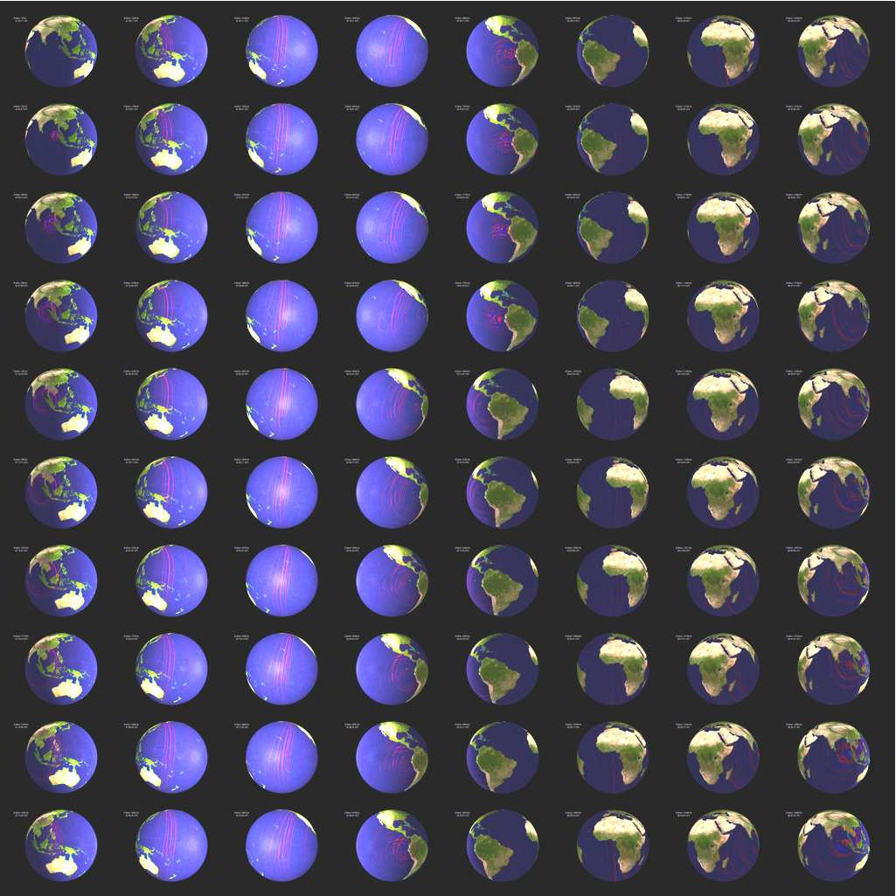

**Table of Contents**

- [Graphics](#cha:graphics)
  - [Meshes](#sec:Meshes)
  - [Movies](#sec:Movies)
    - [Movie Surface](#movie-surface)
    - [Movie Volume](#sub:Movie-Volume)
  - [Finite-Frequency Kernels](#sec:Finite-Frequency-Kernels)

Graphics
========

Meshes
------

Use the serial code `combine_AVS_DX.f90` (type ‘`make combine_AVS_DX`’ and then ‘`xcombine_AVS_DX`’) to generate AVS output files (in AVS UCD format) or OpenDX output files showing the mesh, the MPI partition (slices), the $\nchunks$ chunks, the source and receiver location, etc. Use the AVS UCD files `AVS_continent_boundaries.inp` and `AVS_plate_boundaries.inp` or the OpenDX files `DX_continent_boundaries.dx` and `DX_plate_boundaries.dx` (that can be created using Perl scripts located in `utils/Visualization/opendx_AVS`) for reference.

Movies
------

To make a surface or volume movie of the simulation, set parameters `MOVIE_SURFACE`, `MOVIE_VOLUME`, and `NTSTEP_BETWEEN_FRAMES` in the `Par_file`. Turning on the movie flags, in particular `MOVIE_VOLUME`, produces large output files. `MOVIE_VOLUME` files are saved in the `LOCAL_PATH` directory, whereas `MOVIE_SURFACE` output files are saved in the `OUTPUT_FILES` directory. We save the velocity field. The look of a movie is determined by the half-duration of the source. The half-duration should be large enough so that the movie does not contain frequencies that are not resolved by the mesh, i.e., it should not contain numerical noise. This can be accomplished by selecting a CMT `HALF_DURATION` \> 1.1 $\times$ smallest period (see figure [\[fig:CMTSOLUTION-file\]](#fig:CMTSOLUTION-file)).

When `MOVIE_SURFACE` = `.true.` or `MOVIE_VOLUME` `=` `.true.`, the half duration of each source in the `CMTSOLUTION` file is replaced by

> $$\sqrt{(}\mathrm{\mathtt{HALF\_DURATIO}\mathtt{N}^{2}}+\mathrm{\mathtt{HDUR\_MOVI}\mathtt{E}^{2}})$$ **NOTE:** If `HDUR_MOVIE` is set to 0.0, the code will select the appropriate value of 1.1 $\times$ smallest period. As usual, for a point source one can set `HALF_DURATION` in the `Par_file` to be 0.0 and `HDUR_MOVIE` = 0.0 to get the highest frequencies resolved by the simulation, but for a finite source one would keep all the `HALF_DURATION`s as prescribed by the finite source model and set `HDUR_MOVIE` = 0.0.

### Movie Surface

When running `xspecfem3D` with the `MOVIE_SURFACE` flag turned on the code outputs `moviedata??????` files in the `OUTPUT_FILES` directory. The files are in a fairly complicated binary format, but there are two programs provided to convert the output into more user friendly formats. The first one, `create_movie_AVS_DX.f90` outputs data in ASCII, OpenDX, AVS, or ParaView format. Run the code from the source directory (type ‘`make` `create_movie_AVS_DX`’ first) to create an input file in your format of choice. The code will prompt the user for input parameters. The second program `create_movie_GMT_global.f90` outputs ASCII xyz files, convenient for use with GMT. This codes uses significantly less memory than `create_movie_AVS_DX.f90` and is therefore useful for high resolution runs. A README file and sample Perl scripts to create movies using GMT are provided in directory `utils/Visualization/GMT`.

Figure: Snapshots from a global movie for the December 26, 2004, M=9.2 Sumatra-Andaman earthquake. Time runs down successive columns.

### Movie Volume

When running xspecfem3D with the `MOVIE_VOLUME` flag turned on, the code outputs several files in `LOCAL_DIR`. As the files can be very large, there are several flags in the `Par_file` that control the region in space and time that is saved. These are: `MOVIE_TOP_KM`, `MOVIE_BOTTOM_KM`, `MOVIE_WEST_DEG`, `MOVIE_EAST_DEG`, `MOVIE_NORTH_DEG`, `MOVIE_SOUTH_DEG`, `MOVIE_START` and `MOVIE_STOP`. The code will save a given element if the center of the element is in the prescribed volume.

The Top/Bottom:  
Depth below the surface in kilometers, use `MOVIE_TOP` `=` `-100.0` to make sure the surface is stored.

West/East:  
Longitude, degrees East \[-180.0/180.0\]

North/South:  
Latitute, degrees North \[-90.0/90.0\]

Start/Stop:  
Frames will be stored at `MOVIE_START` `+` `i``*``NSTEP_BETWEEN_FRAMES`, where `i=(0,1,2..)` while `i``*``NSTEP_BETWEEN_FRAMES` `<=` `MOVIE_STOP`

The code saves several files, and the output is saved by each processor. The first is `proc??????_movie3D_info.txt` which contains two numbers, first the number of points within the prescribed volume within this particular slice, and second the number of elements. The next files are `proc??????_movie3D_x.bin`, `proc??????_movie3D_y.bin`, `proc??????_movie3D_z.bin` which store the locations of the points in the 3D mesh.

Finally the code stores the “value” at each of the points. Which value is determined by `MOVIE_VOLUME_TYPE` in the `Par_file`. Choose 1 to save the strain, 2 to save the time integral of strain, and 3 to save $\mu$\*time integral of strain in the subvolume. Choosing 4 causes the code to save the trace of the stress and the deviatoric stress in the whole volume (not the subvolume in space), at the time steps specified. The name of the output file will depend on the `MOVIE_VOLUME_TYPE` chosen.

Setting `MOVIE_VOLUME_COARSE` `=` `.true.` will make the code save only the corners of the elements, not all the points within each element for `MOVIE_VOLUME_TYPE` `=` `1,2,3`.

To make the code output your favorite “value” simply add a new `MOVIE_VOLUME_TYPE`, a new subroutine to `write_movie_volume.f90` and a subroutine call to `specfem3D.F90`.

A utility program to combine the files produced by `MOVIE_VOLUME_TYPE` `=` `1,2,3` is provided in `combine_paraview`
`_strain_data.f90`. Type `xcombine_paraview_strain_data` to get the usage statement. The program `combine_vol`
`_data.f90` can be used for `MOVIE_VOLUME_TYPE` `=` `4`.

Finite-Frequency Kernels
------------------------

The finite-frequency kernels computed as explained in Section [\[sec:Adjoint-simulation-finite\]](#sec:Adjoint-simulation-finite) are saved in the `LOCAL_PATH` at the end of the simulation. Therefore, we first need to collect these files on the front end, combine them into one mesh file, and visualize them with some auxilliary programs. Examples of kernel simulations may be found in the `EXAMPLES` directory.

1.  **Create slice files**

    We will only discuss the case of one source-receiver pair, i.e., the so-called banana-doughnut kernels. Although it is possible to collect the kernel files from all slices onto the front end, it usually takes up too much storage space (at least tens of gigabytes). Since the sensitivity kernels are the strongest along the source-receiver great circle path, it is sufficient to collect only the slices that are along or close to the great circle path.

    A Perl script `utils/Visualization/VTK_Paraview/global_slice_number.pl` can help to figure out the slice numbers that lie along the great circle path (both the minor and major arcs), as well as the slice numbers required to produce a full picture of the inner core if your kernel also illuminates the inner core.

    1.  You need to first compile the utility programs provided in the `utils/Visualization/VTK_Paraview/`
        `global_slice_util `directory. Then copy the `CMTSOLUTION` file, `STATIONS_ADJOINT`, and `Par_file`, and run:

            global_slice_number.pl CMTSOLUTION STATIONS_ADJOINT Par_file

        In the case of visualization boundary kernels or spherical cross-sections of the volumetric kernels, it is necessary to obtain the slice numbers that cover a belt along the source and receiver great circle path, and you can use the hybrid version:

            globe_slice_number2.pl CMTSOLUTION STATIONS _ADJOINT \
                 Par_file belt_width_in_degrees

        A typical value for `belt_width_in_degrees` can be 20.

    2.  For a full 6-chunk simulation, this script will generate the `slice_minor`, `slice_major`, `slice_ic` files, but for a one-chunk simulation, this script only generates the `slice_minor` file.

    3.  For cases with multiple sources and multiple receivers, you need to provide a slice file before proceeding to the next step.

2.  **Collect the kernel files**

    After obtaining the slice files, you can collect the corresponding kernel files from the given slices.

    1.  To accomplish this, you can use or modify the scripts in `utils/collect_database` directory:

            copy_m(oc,ic)_globe_database.pl slice_file lsf_machine_file filename [jobid]

        for volumetric kernels, where `lsf_machine_file` is the machine file generated by the LSF scheduler, `filename` is the kernel name (e.g., `rho_kernel`, `alpha_kernel` and `beta_kernel`), and the optional `jobid` is the name of the subdirectory under `LOCAL_PATH` where all the kernel files are stored. For boundary kernels, you need to use

            copy_surf_globe_database.pl slice_file lsf_machine_file filename [jobid]

        where the filename can be `Moho_kernel`, `d400_kernel`, `d670_kernel`, `CMB_kernel` and `ICB_kernel`.

    2.  After executing this script, all the necessary mesh topology files as well as the kernel array files are collected to the local directory on the front end.

3.  **Combine kernel files into one mesh file**

    We use an auxiliary program `combine_vol_data.F90` to combine the volumetric kernel files from all slices into one mesh file, and `combine_surf_data.F90` to combine the surface kernel files.

    1.  Compile it in the global code directory:

            make combine_vol_data
            ./bin/xcombine_vol_data slice_list kernel_filename input_topo_dir \
                           input_file_dir output_dir low/high-resolution-flag-0-or-1 [region]

        where `input_dir` is the directory where all the individual kernel files are stored, and `output_dir` is where the mesh file will be written. Give 0 for low resolution and 1 for high resolution. If region is not specified, all three regions (crust and mantle, outer core, inner core) will be collected, otherwise, only the specified region will be.

        Here is an example:

            ./xcombine_vol_data slices_major alpha_kernel input_topo_dir input_file_dir output_dir 1

        For surface sensitivity kernels, use

            ./bin/xcombine_surf_data slice_list filename surfname input _dir output_dir low/high-resolution 2D/3D

        where `surfname` should correspond to the specific kernel file name, and can be chosen from `Moho`, `400`, `670`, `CMB` and `ICB`.

    2.  Use 1 for a high-resolution mesh, outputting all the GLL points to the mesh file, or use 0 for low resolution, outputting only the corner points of the elements to the mesh file. Use 0 for 2D surface kernel files and 1 for 3D volumetric kernel files.

    3.  Use region = 1 for the mantle, region = 2 for the outer core, region = 3 for the inner core, and region = 0 for all regions.

    4.  The output mesh file will have the name `reg_?_rho(alpha,beta)_kernel.mesh,` or` `
        `reg_?_Moho(d400,d670,CMB,ICB)_kernel.surf.`

    You can also use the binaries `xcombine_vol_data_vtk` or `xcombine_vol_data_vtu` with the same argument list to directly output `.vtk` or `.vtu` files, respectively. This will make the following conversion step for `.mesh` files unnecessary.

4.  **Convert mesh files into .vtu files**

    1.  We next convert the `.mesh` file into the VTU (Unstructured grid file) format which can be viewed in ParaView, for example:

            mesh2vtu -i file.mesh -o file.vtu

    2.  Notice that this program `mesh2vtu`, in the `utils/Visualization/VTK_Paraview/mesh2vtu` directory, uses the VTK run-time library for its execution. Therefore, make sure you have it properly installed.

5.  **Copy over the source and receiver .vtk file**

    In the case of a single source and a single receiver, the simulation also generates the `OUTPUT_FILES/sr.vtk` file to describe the source and receiver locations, which can be viewed in Paraview in the next step.

6.  **View the mesh in ParaView**

    Finally, we can view the mesh in ParaView .

    1.  Open ParaView.

    2.  From the top menu, File $\rightarrow$ Open data, select `file.vtu`, and click the Accept button.

        - If the mesh file is of moderate size, it shows up on the screen; otherwise, only the outline is shown.

    3.  Click Display Tab $\rightarrow$ Display Style $\rightarrow$ Representation and select wireframe of surface to display it.

    4.  To create a cross-section of the volumetric mesh, choose Filter $\rightarrow$ cut, and under Parameters Tab, choose Cut Function $\rightarrow$ plane.

    5.  Fill in center and normal information given by the standard output from `global_slice_number.pl` script.

    6.  To change the color scale, go to Display Tab $\rightarrow$ Color $\rightarrow$ Edit Color Map and reselect lower and upper limits, or change the color scheme.

    7.  Now load in the source and receiver location file by File $\rightarrow$ Open data, select `sr.vt`k, and click the Accept button. Choose Filter $\rightarrow$ Glyph, and represent the points by ‘spheres’.

    8.  For more information about ParaView, see the ParaView Users Guide .

For illustration purposes, Figure [1.1](#fig:P-wave-speed-finite-frequency) shows P-wave speed finite-frequency kernels from cross-correlation traveltime and amplitude measurements for a P arrival recorded at an epicentral distance of $60^{\circ}$ for a deep event.

Figure: P-wave speed finite-frequency kernels from cross-correlation traveltime (top) and amplitude (bottom) measurements for a P arrival recorded at an epicentral distance of $60^{\circ}$. The kernels together with the associated files and routines to reproduce them may be found in `EXAMPLES/global_PREM_kernels/`. 

-----
> This documentation has been automatically generated by [pandoc](http://www.pandoc.org)
> based on the User manual (LaTeX version) in folder doc/USER_MANUAL/
> (Nov 21, 2022)

