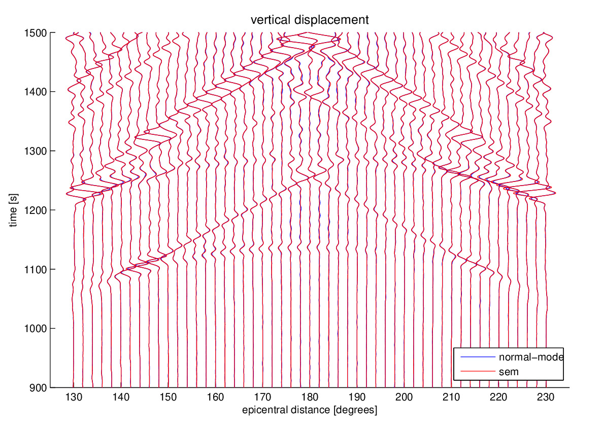

**Table of Contents**

- [Benchmarks](#benchmarks)
  - [References](#references)

Benchmarks
==========

Komatitsch and Tromp (2002a, 2002b) carefully benchmarked the spectral-element simulations of global seismic waves against normal-mode seismograms. Version 4.0 of `SPECFEM3D_GLOBE` has been benchmarked again following the same procedure.

In this appendix we present two tests: a ‘long-period’ (periods longer than 17 s) simulation of a shallow event in isotropic PREM (Dziewoński and Anderson 1981) without the ocean layer, without attenuation but including the effects of self-gravitation (in the Cowling approximation) (Figures [1.1](#fig:Vanuatu-with-Vertical) and [1.2](#fig:Vanuatu-with-Transverse)), and a ‘short-period’ (periods longer than 9 s) simulation of a deep event in transversely isotropic PREM without the ocean layer and including the effects of self-gravitation and attenuation (Figures [1.3](#fig:Bolivia-with-Vertical), [1.4](#fig:Bolivia-with-Transverse) and [1.5](#fig:Bolivia-PKP)).

Figure: Normal-mode (blue) and SEM (red) vertical displacements in isotropic PREM considering the effects of self-gravitation but not attenuation for 13 stations at increasing distance from the 1999 November 26th Vanuatu event located at 15 km depth. The SEM computation is accurate for periods longer than 17 s. The seismograms have been filtered between 50 s and 500 s. The station names are indicated on the left. 

 
Figure: Same as in Figure [1.1
 for the transverse displacements.](figures/vanuatu_trans.jpg)

Figure: Normal-mode (blue) and SEM (red) vertical displacements in transversely isotropic PREM considering the effects of self-gravitation and attenuation for 12 stations at increasing distance from the 1994 June 9th Bolivia event located at 647 km depth. The SEM computation is accurate for periods longer than 9 s. The seismograms have been filtered between 10 s and 500 s. The station names are indicated on the left.

 
Figure: Same as in Figure [1.3
 for the transverse displacements.](figures/bolivia_trans.jpg)

Figure: Seismograms recorded between 130 degrees and 230 degrees, showing in particular the good agreement for core phases such as PKP. This figure is similar to Figure 24 of Komatitsch and Tromp (2002a). The results have been filtered between 15 s and 500 s.

The normal-mode synthetics are calculated with the code `QmXD` using mode catalogs with a shortest period of 8 s generated by the code `OBANI`. No free-air, tilt, or gravitational potential corrections were applied (Dahlen and Tromp 1998). We also turned off the effect of the oceans in `QmXD`.

The normal-mode and SEM displacement seismograms are first calculated for a step source-time function, i.e., setting the parameter `half` `duration` in the `CMTSOLUTION` file to zero for the SEM simulations. Both sets of seismograms are subsequently convolved with a triangular source-time function using the processing script `utils/seis_process/process_syn.pl`. They are also band-pass filtered and the horizontal components are rotated to the radial and transverse directions (with the script `utils/seis_process/rotate.pl`).

The match between the normal-mode and SEM seismograms is quite remarkable for the experiment with attenuation, considering the very different implementations of attenuation in the two computations (e.g., frequency domain versus time domain, constant Q versus absorption bands).

Further tests can be found in the `EXAMPLES` directory. It contains the normal-mode and SEM seismograms, and the parameters (`STATIONS`, `CMTSOLUTION` and `Par_file`) for the SEM simulations.

Important remark: when comparing SEM results to normal mode results, one needs to convert source and receiver coordinates from geographic to geocentric coordinates, because on the equator the geographic and geocentric latitude are identical but not elsewhere. Even for spherically-symmetric simulations one must perform this conversion because the source and receiver locations provided by www.globalCMT.org and IRIS involve geographic coordinates.

References
----------

Dahlen, F. A., and J. Tromp. 1998. *Theoretical Global Seismology*. Princeton, New-Jersey, USA: Princeton University Press.

Dziewoński, A. M., and D. L. Anderson. 1981. “Preliminary Reference Earth Model.” *Phys. Earth Planet. Inter.* 25 (4): 297–356.

Komatitsch, D., and J. Tromp. 2002a. “Spectral-Element Simulations of Global Seismic Wave Propagation-I. Validation.” *Geophys. J. Int.* 149 (2): 390–412. <https://doi.org/10.1046/j.1365-246X.2002.01653.x>.

———. 2002b. “Spectral-Element Simulations of Global Seismic Wave Propagation-II. 3-D Models, Oceans, Rotation, and Self-Gravitation.” *Geophys. J. Int.* 150 (1): 303–18. <https://doi.org/10.1046/j.1365-246X.2002.01716.x>.

-----
> This documentation has been automatically generated by [pandoc](http://www.pandoc.org)
> based on the User manual (LaTeX version) in folder doc/USER_MANUAL/
> (Dec 20, 2023)

