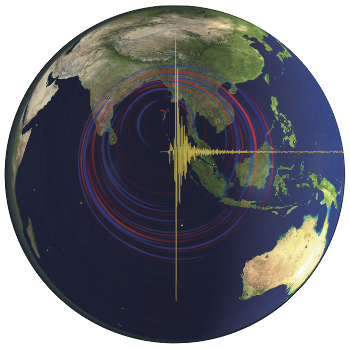

User Manual
===========
> This documentation has been automatically generated by [pandoc](http://www.pandoc.org)
> based on the User manual (LaTeX version) in folder doc/USER_MANUAL/
> (Apr  1, 2022)

>
> For the current PDF version see: [manual_SPECFEM3D_GLOBE.pdf](https://github.com/geodynamics/specfem3d_globe/raw/devel/doc/USER_MANUAL/manual_SPECFEM3D_GLOBE.pdf)
>

**Table of Contents**

- [01 Introduction](01_introduction.md)
- [02 Getting Started](02_getting_started.md)
- [03 Running The Mesher](03_running_the_mesher.md)
- [04 Running The Solver](04_running_the_solver.md)
- [05 Regional Simulations](05_regional_simulations.md)
- [06 Adjoint Simulations](06_adjoint_simulations.md)
- [07 Doing Tomography](07_doing_tomography.md)
- [08 Noise Simulations](08_noise_simulations.md)
- [09 Gravity Calculations](09_gravity_calculations.md)
- [10 Graphics](10_graphics.md)
- [11 Running Scheduler](11_running_scheduler.md)
- [12 Changing The Model](12_changing_the_model.md)
- [13 Post Processing](13_post_processing.md)
- [14 Informations For Developers](14_informations_for_developers.md)
- [A Reference Frame](A_reference_frame.md)
- [B Non-Dimensionalization Conventions](B_non-dimensionalization_conventions.md)
- [C Benchmarks](C_benchmarks.md)
- [D SAC Headers](D_SAC_headers.md)
- [E Channel Codes](E_channel_codes.md)
- [F Troubleshooting](F_troubleshooting.md)
- [G License](G_license.md)
- [Authors](authors.md)
- [Bug Reports](bug_reports.md)
- [Copyright And Version](copyright_and_version.md)
- [Features](features.md)
- [Notes And Acknowledgement](notes_and_acknowledgement.md)
- [Sponsors](sponsors.md)
