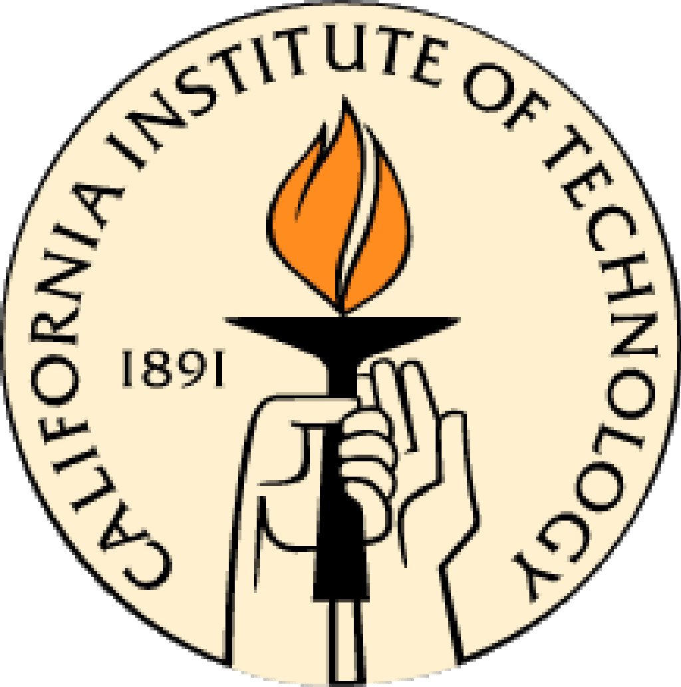
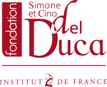
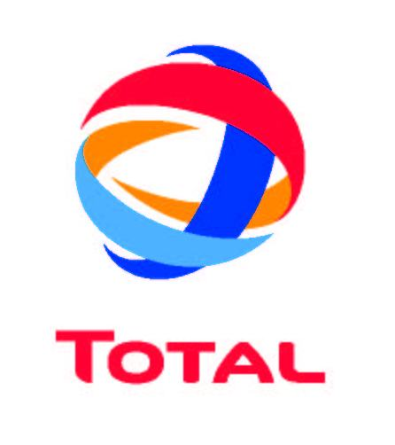

**Table of Contents**

- [Current and past main participants or main sponsors of the SPECFEM project (in no particular order)](#current-and-past-main-participants-or-main-sponsors-of-the-specfem-project-in-no-particular-order)

Current and past main participants or main sponsors of the SPECFEM project (in no particular order)
===================================================================================================

                              

-----
> This documentation has been automatically generated by [pandoc](http://www.pandoc.org)
> based on the User manual (LaTeX version) in folder doc/USER_MANUAL/
> (Nov  9, 2022)

